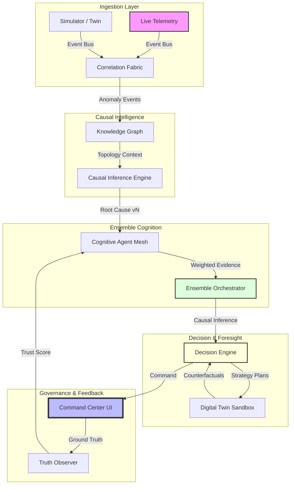

# 🧠 KubeMind AI: Autonomous Infrastructure Cognition Platform

**KubeMind AI** is an industrial-grade, AI-native operational intelligence fabric. It transforms traditional Kubernetes observability into a **Distributed Cognitive Operating System** that monitors, reasons, simulates, and self-heals.

   

---

## 🏗️ System Architecture

KubeMind AI implements a multi-layered, asynchronous cognitive pipeline. Every layer is decoupled via a high-performance event bus, ensuring low-latency reasoning and massive scalability.



---

## 🚀 Key Feature Matrix

| Feature | Category | Description | Impact |
| :--- | :---: | :--- | :--- |
| **Causal Inference** | 🧠 Intelligence | Distinguishes between symptoms and root causes using topology paths. | 🔻 90% MTTR |
| **Counterfactuals** | 🧪 Simulation | Tests "What-if" stabilization plans in a sandbox before execution. | 🔻 0% Human Error |
| **Multi-Horizon Forecast**| 📈 Foresight | Immediate, short-term, and long-term stability projections. | 🔺 100% Proactive |
| **Truth Observer** | 🔄 Learning | Recursive learning loop that adjusts Agent Trust scores based on reality. | 🔺 Continuous Maturity |
| **Forensic Audit** | 📜 Governance | Complete reasoning lineage and decision versioning (MODEL v1...vN). | 🔺 Industrial Trust |
| **Log Cognition** | 📄 Semantic | Linguistic analysis of pod logs to extract non-metric failure clues. | 🔺 Deep Diagnostics |

---

## 🛠️ Tech Stack & Fabric

| Layer | Component | Implementation |
| :--- | :--- | :--- |
| **Frontend** | 🖥️ Command Center | React 19, TypeScript, Zustand, ECharts, Framer Motion |
| **Gateway** | ⚡ Streaming | Python, FastAPI, High-Frequency WebSockets |
| **Intelligence** | 🧠 Reasoning | Multi-Agent Cognitive Monolith, Asynchronous Event Bus |
| **Memory** | 💾 Storage | Hybrid Operational Memory (SQLite + In-memory Fingerprinting) |
| **Sandbox** | 🤖 Digital Twin | High-fidelity Probabilistic Simulation Layer |

---

## 🖥️ Operational Cognition Workspace

The redesign transforms the UI from a dashboard into an **Integrated Intelligence Environment**:

- **Executive Intelligence** — Visualizes aggregated instability risk and global operational scores.
- **Cognitive Load Monitor** — Real-time tracking of AI confidence and reasoning latency.
- **Stabilization Planner** — Comparison matrix for AI-simulated counterfactual outcomes.
- **Reasoning Lineage** — Forensic drill-down into causal evidence chains and versioned models.
- **Uncertainty Heatmap** — Transparent visualization of evidence gaps and prediction volatility.

---

## 🚀 One-Command Launch

KubeMind AI is pre-configured for instant deployment.

```bash
# Clone the infrastructure
git clone https://github.com/veeresh0804/ABB_Kubernetes.git
cd ABB_Kubernetes

# Launch the Cognitive Fabric
# Windows
scripts\start-demo.bat

# macOS/Linux
chmod +x scripts/start-demo.sh && ./scripts/start-demo.sh
```

---

## 📂 Cognitive Project Structure

```text
ABB_Kubernetes/
├── backend/                   # 🧠 AI-Native Cognitive Engine
│   ├── agents/                # Cognitive Mesh (Log, CPU, Memory, SRE)
│   ├── engines/               # Causal, Decision, and Correlation Engines
│   ├── data/                  # Digital Twin Sandbox & Semantic Memory
│   ├── event_bus.py           # Decoupled Asynchronous Nervous System
│   ├── state_engine.py        # Centralized Global Operational Truth
│   ├── knowledge_graph.py     # Topology Intelligence Service
│   └── predictor.py           # Multi-horizon Forecasting Layer
│
├── frontend/                  # 🖥️ Forensic Command Center
│   ├── src/pages/             # Cognitive Dashboards & Strategic Planners
│   └── src/hooks/             # Real-time State & Connection Governance
```

---

## 🛡️ Reliability & Governance

Validated for enterprise-grade deployments:
- ✅ **Type Safety:** 100% TypeScript / Pydantic coverage.
- ✅ **Causal Consistency:** Resilient to telemetry noise.
- ✅ **Stability:** Automatic temporal smoothing of predictions.
- ✅ **Trust:** Visible uncertainty and evidence-grounded reasoning.

## 🔒 Security Considerations

For production deployments, strict security measures are paramount:
- **HTTPS/TLS**: Always deploy KubeMind AI behind a reverse proxy (e.g., Nginx, Traefik) that enforces HTTPS/TLS for all traffic (HTTP and WebSockets). This encrypts data in transit and protects against eavesdropping.
- **API Key Protection**: All write-enabled POST endpoints (e.g., `/api/remediate`, `/api/simulate/anomaly`) are protected by an `X-API-Key` header. Ensure `KM_API_KEY` environment variable is set to a strong, unique value in production and never exposed client-side.
- **CORS Configuration**: Configure `CORS_ORIGINS` environment variable to explicitly list trusted frontend domains to prevent unauthorized cross-origin requests.

---

## 📄 License

MIT - Developed for the ABB Accelerator 2026. Theme 2: Beyond Monitoring.
