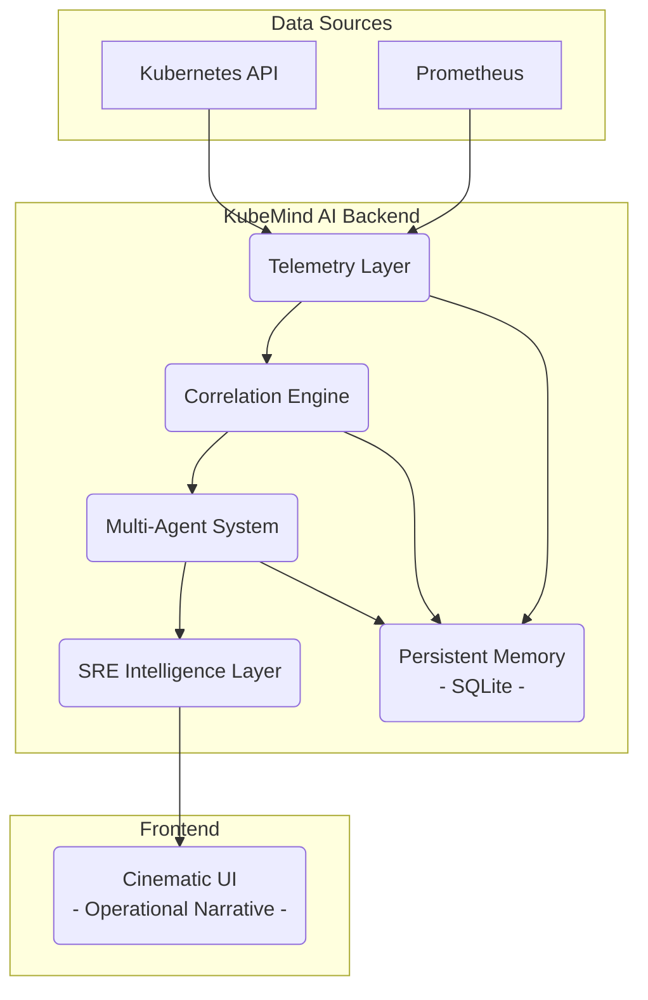

```mermaid
graph TD
    subgraph "Data Sources"
        direction LR
        A[Kubernetes API]
        B[Prometheus]
    end

    subgraph "KubeMind AI Backend"
        direction TB
        C(Telemetry Layer)
        D(Correlation Engine)
        E(Multi-Agent System)
        F(SRE Intelligence Layer)
        G(Persistent Memory <br/>- SQLite -)
    end
    
    subgraph "Frontend"
        H(Cinematic UI <br/>- Operational Narrative -)
    end

    A --> C
    B --> C
    C --> D
    D --> E
    E --> F
    F --> H
    C --> G
    D --> G
    E --> G
```
