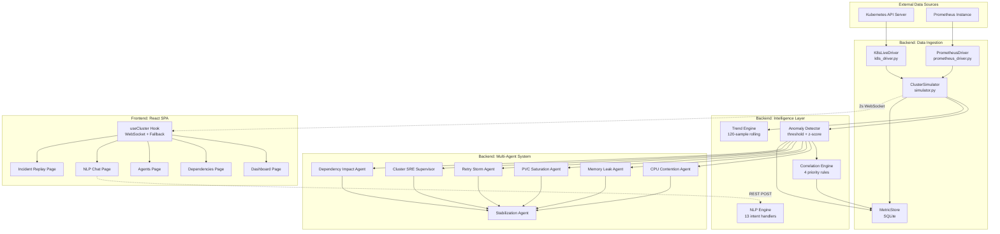
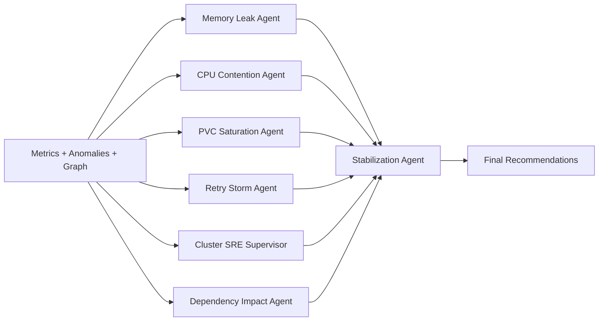
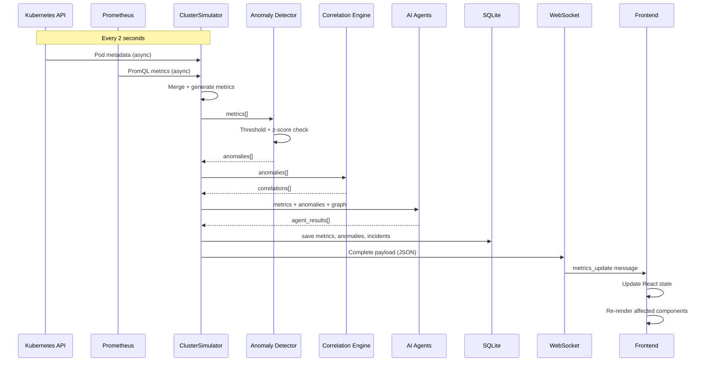
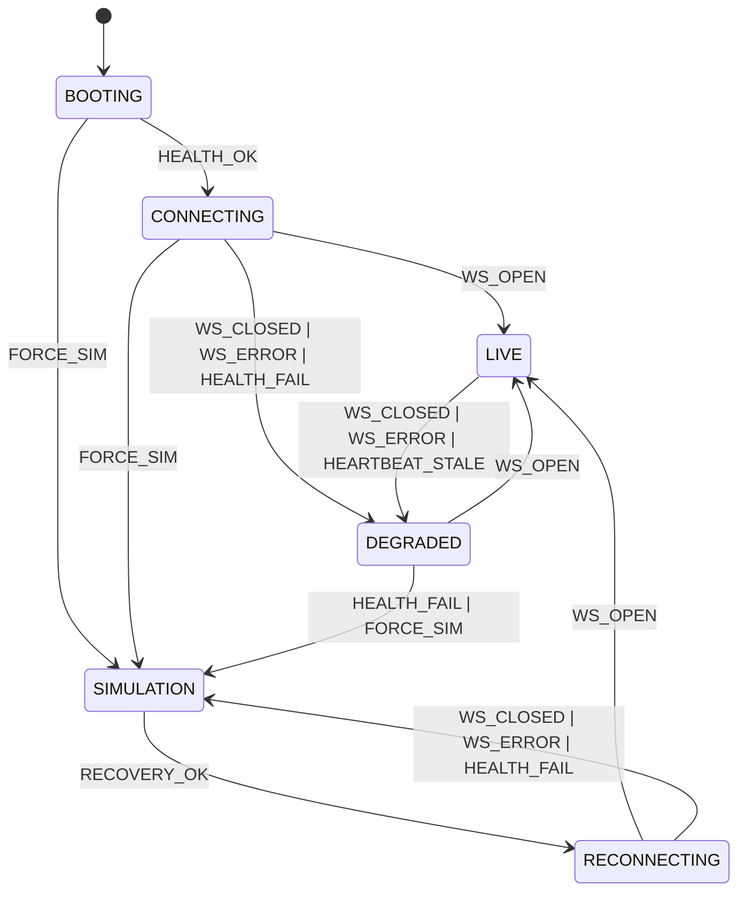

# KubeMind AI — Master Technical Report

**Industrial AI-Assisted Kubernetes Operational Intelligence Platform**

*ABB Accelerator 2026 · Theme 2: Beyond Monitoring*

**Version:** 1.0.0  
**Classification:** Enterprise Technical Documentation  
**Date:** May 2026

---

## Table of Contents

1. [Cover Page](#1-cover-page)
2. [Abstract](#2-abstract)
3. [Executive Summary](#3-executive-summary)
4. [Problem Statement](#4-problem-statement)
5. [Industry Challenges](#5-industry-challenges)
6. [Existing System Limitations](#6-existing-system-limitations)
7. [Proposed Solution](#7-proposed-solution)
8. [System Objectives](#8-system-objectives)
9. [Core Features](#9-core-features)
10. [System Architecture](#10-system-architecture)
11. [Architecture Diagram Explanation](#11-architecture-diagram-explanation)
12. [Frontend Architecture](#12-frontend-architecture)
13. [Backend Architecture](#13-backend-architecture)
14. [WebSocket Communication Architecture](#14-websocket-communication-architecture)
15. [Realtime Telemetry Pipeline](#15-realtime-telemetry-pipeline)
16. [Kubernetes Integration](#16-kubernetes-integration)
17. [Prometheus Integration](#17-prometheus-integration)
18. [AI Agent Architecture](#18-ai-agent-architecture)
19. [Incident Detection Engine](#19-incident-detection-engine)
20. [Dependency Mapping Engine](#20-dependency-mapping-engine)
21. [Topology Visualization Engine](#21-topology-visualization-engine)
22. [Operational Timeline Engine](#22-operational-timeline-engine)
23. [Simulator & Fallback Architecture](#23-simulator--fallback-architecture)
24. [Realtime Rendering Optimization](#24-realtime-rendering-optimization)
25. [Dashboard UI/UX Architecture](#25-dashboard-uiux-architecture)
26. [Industrial Design System](#26-industrial-design-system)
27. [Light/Dark Theme System](#27-lightdark-theme-system)
28. [AI Recommendation Engine](#28-ai-recommendation-engine)
29. [Stabilization Recommendation Workflow](#29-stabilization-recommendation-workflow)
30. [Operational Storytelling System](#30-operational-storytelling-system)
31. [Connection Resilience & Recovery](#31-connection-resilience--recovery)
32. [Reconnect & Failover Logic](#32-reconnect--failover-logic)
33. [Data Flow Architecture](#33-data-flow-architecture)
34. [API Architecture](#34-api-architecture)
35. [Database Architecture](#35-database-architecture)
36. [Deployment Architecture](#36-deployment-architecture)
37. [Docker/Environment Support](#37-dockerenvironment-support)
38. [Cross-Machine Portability](#38-cross-machine-portability)
39. [Performance Optimization](#39-performance-optimization)
40. [Low-Latency Rendering Techniques](#40-low-latency-rendering-techniques)
41. [Security Considerations](#41-security-considerations)
42. [Reliability Engineering](#42-reliability-engineering)
43. [Simulation Mode Design](#43-simulation-mode-design)
44. [Demo Workflow](#44-demo-workflow)
45. [Industrial Use Cases](#45-industrial-use-cases)
46. [Edge & Industrial Deployment Possibilities](#46-edge--industrial-deployment-possibilities)
47. [Scalability Discussion](#47-scalability-discussion)
48. [Challenges Faced During Development](#48-challenges-faced-during-development)
49. [Engineering Decisions & Tradeoffs](#49-engineering-decisions--tradeoffs)
50. [Future Enhancements](#50-future-enhancements)
51. [Comparative Advantages](#51-comparative-advantages)
52. [Conclusion](#52-conclusion)
53. [References](#53-references)
54. [Appendix](#54-appendix)
55. [Tech Stack Summary](#55-tech-stack-summary)
56. [Folder Structure Documentation](#56-folder-structure-documentation)
57. [Expanded Frontend Architecture (Phase 2+)](#57-expanded-frontend-architecture-phase-2)
58. [Expanded Backend Architecture (Event-Driven Cognitive Pipeline)](#58-expanded-backend-architecture-event-driven-cognitive-pipeline)
59. [New AI Agent Systems](#59-new-ai-agent-systems)
60. [New Intelligence Engines](#60-new-intelligence-engines)
61. [Updated Folder Structure](#61-updated-folder-structure)
62. [Updated File Count and Metrics](#62-updated-file-count-and-metrics)
63. [Updated Version and Classification](#63-updated-version-and-classification)

---

## 1. Cover Page

| Field | Value |
|-------|-------|
| **Project Name** | KubeMind AI |
| **Project Type** | Industrial AI-Assisted Kubernetes Operational Intelligence Platform |
| **Version** | 1.0.0 |
| **Event** | ABB Accelerator 2026 — Theme 2: Beyond Monitoring |
| **Architecture** | React 19 + TypeScript SPA / FastAPI Python Backend / WebSocket Streaming |
| **AI Engine** | 7-Specialized Multi-Agent Diagnostic System |
| **Data Layer** | Kubernetes API Driver + Prometheus PromQL + Cluster Simulator + SQLite |
| **Deployment** | Cross-platform (Windows/macOS/Linux), Minikube/K3s/MicroK8s compatible |
| **Operating Modes** | LIVE / DEGRADED / SIMULATION (automatic transition) |

---

## 2. Abstract

KubeMind AI is an industrial-grade, AI-assisted Kubernetes operational intelligence platform that transcends traditional monitoring paradigms by delivering real-time causal analysis, multi-agent AI diagnostics, dependency-aware blast radius computation, and natural language operational querying. The platform ingests telemetry from Kubernetes API servers and Prometheus instances through a layered data ingestion pipeline, processes metrics through statistical anomaly detection and trend analysis engines, and synthesizes findings through seven specialized AI agents — each owning a distinct resource domain (CPU, memory, storage I/O, network, site reliability, dependency impact, and cross-agent stabilization).

The system operates across three modes — LIVE (real cluster telemetry), DEGRADED (backend reachable but WebSocket disconnected), and SIMULATION (browser-side fallback) — with automatic state machine transitions ensuring operational continuity under any failure condition. A correlation engine maps multi-service anomaly patterns to human-readable causal chains, while a BFS-based dependency impact analysis computes blast radius across the service topology. The frontend renders this intelligence through an industrial command-center interface built with React 19, TypeScript, and ECharts, featuring force-directed topology graphs, real-time metric cards, AI agent diagnostic panels, an NLP query interface, and an incident replay timeline backed by SQLite persistence.

This report documents the complete architecture, implementation details, engineering decisions, and industrial positioning of the KubeMind AI platform.

---

## 3. Executive Summary

KubeMind AI addresses a fundamental gap in containerized operations: existing monitoring tools generate voluminous metric alerts but cannot explain *why* systems fail, *how* failures propagate, or *what* actions should be taken. In industrial edge environments — where Kubernetes clusters manage SCADA-adjacent workloads, factory-floor data pipelines, and OT-network-isolated services — this gap translates directly into operational risk.

The platform delivers:

- **Real-time telemetry streaming** at 2-second intervals via WebSocket, with automatic fallback to browser-side simulation
- **7 specialized AI agents** running in parallel each telemetry cycle, producing auditable reasoning logs with confidence scores
- **Statistical anomaly detection** combining threshold-based gating with z-score analysis over 60-sample sliding windows
- **Causal correlation engine** with 4 priority-ordered rules mapping multi-service patterns to root cause chains
- **BFS-based blast radius computation** traversing the service dependency graph to quantify failure propagation impact
- **Natural language query interface** with 13 intent handlers providing context-aware responses from live cluster state
- **Three-mode operational continuity** (LIVE/DEGRADED/SIMULATION) with a 6-state connection state machine and exponential backoff reconnection
- **SQLite persistence layer** capturing metrics, anomalies, and incidents for post-mortem analysis and incident replay

The platform is designed for industrial edge deployment on Minikube, K3s, or MicroK8s, with zero cloud dependency — all analysis runs locally, satisfying OT network isolation requirements.

---

## 4. Problem Statement

Engineers managing containerized Kubernetes/K3s/MicroK8s environments — particularly in industrial edge deployments — face three compounding operational challenges:

### 4.1 Signal Noise Without Causal Context

A single PVC saturation event on a PostgreSQL database can generate 15+ separate metric alerts across CPU, memory, latency, and network dimensions. Operators receive a flood of disconnected alerts with no indication that they share a common root cause. Mean Time to Diagnosis (MTTD) increases proportionally with alert volume.

### 4.2 Dependency Blindness

No unified tool correlates CPU, memory, disk I/O, and network behavior across service relationships. An operator cannot quickly determine: "Is this pod slow because of its own resource exhaustion, or because an upstream dependency is degrading?" In industrial environments, a failure in one subsystem can silently degrade an entire control pipeline.

### 4.3 Reactive Operations

Teams respond after failures occur. No system predicts failure before it happens (e.g., detecting monotonic memory growth that will lead to OOMKill) or provides operational intelligence accessible through natural language — requiring operators to master PromQL, Grafana dashboards, and kubectl simultaneously.

---

## 5. Industry Challenges

### 5.1 Industrial Edge Constraints

| Challenge | Impact |
|-----------|--------|
| **Network isolation** | OT networks cannot reach cloud-based APM tools |
| **Resource constraints** | Edge nodes have limited CPU/memory for monitoring agents |
| **Single-node clusters** | K3s/MicroK8s deployments may run on a single machine |
| **24/7 operation** | Factory-floor systems cannot tolerate monitoring downtime |
| **Skill gaps** | Not all operators are Kubernetes experts |

### 5.2 Kubernetes Observability Gaps

| Gap | Consequence |
|-----|-------------|
| Metrics without context | Alert fatigue, missed root causes |
| No dependency awareness | Cascading failures appear as independent events |
| Reactive tooling | Incidents detected after user impact |
| Complex query languages | PromQL/LogQL expertise required for troubleshooting |
| Fragmented tooling | Separate tools for metrics, logs, traces, topology |

### 5.3 SRE Operational Burden

Site Reliability Engineers spend disproportionate time correlating alerts across tools, manually tracing dependency chains, and writing runbooks for known failure patterns. KubeMind AI automates this correlation and synthesis.

---

## 6. Existing System Limitations

### 6.1 Prometheus + Grafana

- **Strengths**: Excellent metric collection, flexible PromQL, rich visualization
- **Limitations**: No causal correlation, no AI diagnostics, no dependency mapping, requires PromQL expertise, alerts are independent (no chain analysis)

### 6.2 Kubernetes Dashboard

- **Strengths**: Pod management, resource overview, log access
- **Limitations**: No anomaly detection, no AI analysis, no predictive intelligence, no natural language interface

### 6.3 Commercial APM Platforms (Datadog, New Relic)

- **Strengths**: Comprehensive monitoring, APM tracing, alerting
- **Limitations**: Cloud-dependent (violates OT isolation), expensive, no causal chain analysis, black-box AI with no auditability

### 6.4 KubeMind AI Differentiation

| Capability | Prometheus | K8s Dashboard | Commercial APM | KubeMind AI |
|------------|-----------|---------------|----------------|-------------|
| Real-time telemetry | Yes | Yes | Yes | Yes (2s WebSocket) |
| Anomaly detection | Manual rules | No | Statistical | Threshold + z-score |
| Causal correlation | No | No | Limited | 4 priority rules |
| AI diagnostics | No | No | Black-box | 7 agents, auditable |
| Dependency mapping | No | No | Partial | BFS blast radius |
| NLP querying | No | No | No | 13 intent handlers |
| Edge/offline | No | Partial | No | Full fallback |
| Predictive analysis | No | No | Limited | Trend engine |

---

## 7. Proposed Solution

KubeMind AI is a layered operational intelligence platform that transforms raw Kubernetes telemetry into actionable, causally-correlated, AI-diagnosed operational intelligence.

### 7.1 Architecture Philosophy

```
Data Sources → Ingestion → Intelligence → Synthesis → Presentation
```

Each layer is independently replaceable, enabling deployment flexibility from full production clusters to offline demo environments.

### 7.2 Core Design Principles

1. **Operational continuity**: The dashboard never appears blank — fallback simulation activates automatically
2. **Explainable AI**: Every agent produces auditable reasoning logs, not black-box predictions
3. **Causal over symptomatic**: The correlation engine identifies root causes, not just symptoms
4. **Edge-first**: All analysis runs locally; no cloud dependency
5. **Progressive enhancement**: Works with simulated data, improves with live K8s, excels with Prometheus

---

## 8. System Objectives

| Objective | Implementation |
|-----------|---------------|
| Real-time monitoring | WebSocket streaming at 2-second intervals |
| AI-assisted diagnostics | 7 specialized agents with confidence scoring |
| Anomaly detection | Threshold + z-score sliding window analysis |
| Dependency intelligence | Dynamic discovery + static edges, BFS blast radius |
| Operational storytelling | Causal chains, incident timelines, narrative panels |
| Stabilization recommendations | Cross-agent synthesis with executable remediation |
| Natural language querying | 13 intent handlers with context-aware responses |
| Operational continuity | 6-state connection machine, 3 operating modes |
| Industrial edge support | Minikube/K3s/MicroK8s compatible, offline-capable |
| Persistence & replay | SQLite-backed incident log and metric history |

---

## 9. Core Features

### 9.1 Real-time Telemetry Dashboard

Live CPU, memory, network, PVC I/O, and latency metrics for all pods, rendered as metric cards with sparkline visualizations, updated every 2 seconds via WebSocket.

### 9.2 Infrastructure Topology Graph

Force-directed dependency visualization using ECharts, with nodes sized by severity and edges animated (red pulse) when latency exceeds 80ms threshold.

### 9.3 AI Diagnostic Console

Seven specialized agents running in parallel, each producing status (INFO/WARNING/CRITICAL), findings, reasoning logs, confidence scores, recommendations, and executable buffer actions.

### 9.4 Incident Detection & Correlation

Statistical anomaly detection feeds a priority-ordered correlation engine that maps multi-service patterns to causal chains with affected pod lists and remediation recommendations.

### 9.5 Operational Timeline

Streaming event log with severity classification, phase tracking (DETECTION → ANALYSIS → DIAGNOSIS → MITIGATION), and SQLite-backed persistence for post-mortem replay.

### 9.6 Connection Health Monitoring

Real-time status indicators for backend, WebSocket, Prometheus, and Kubernetes connections, with automatic mode transitions.

### 9.7 Simulation Fallback

Browser-side simulator generating realistic metrics for 5 microservices using sinusoidal base patterns with Gaussian noise, ensuring the dashboard never appears broken.

### 9.8 Dark/Light Theme System

Industrial dark theme (default) and clean light theme with CSS variable-based design system, persisted via localStorage.

---

## 10. System Architecture

### 10.1 Layered Architecture

```
┌──────────────────────────────────────────────────────────────────────┐
│                         KubeMind AI Platform                          │
│                                                                        │
│  ┌─────────────────────────┐         ┌──────────────────────────────┐ │
│  │      Frontend SPA        │         │       FastAPI Backend         │ │
│  │   React 19 + TypeScript  │         │        Python 3.10+           │ │
│  │                          │         │                               │ │
│  │  ┌────────────────────┐  │  WS/    │  ┌─────────────────────────┐ │ │
│  │  │  useCluster Hook   │◄─┼──REST──►│  │  main.py (307 lines)    │ │ │
│  │  │  (583 lines)       │  │         │  │  WebSocket + REST API   │ │ │
│  │  └────────────────────┘  │         │  └───────────┬─────────────┘ │ │
│  │                          │         │              │                │ │
│  │  ┌────────────────────┐  │         │  ┌───────────▼─────────────┐ │ │
│  │  │  Connection State  │  │         │  │   Data Ingestion Layer   │ │ │
│  │  │  Machine (6 states)│  │         │  │                          │ │ │
│  │  └────────────────────┘  │         │  │  simulator.py (290)     │ │ │
│  │                          │         │  │  k8s_driver.py (306)    │ │ │
│  │  ┌────────────────────┐  │         │  │  prometheus_driver.py   │ │ │
│  │  │  Pages (5 routes)  │  │         │  │  metric_store.py (141)  │ │ │
│  │  │  Dashboard         │  │         │  └───────────┬─────────────┘ │ │
│  │  │  Dependencies      │  │         │              │                │ │
│  │  │  Agents            │  │         │  ┌───────────▼─────────────┐ │ │
│  │  │  NLPChat           │  │         │  │   Intelligence Layer     │ │ │
│  │  │  IncidentReplay    │  │         │  │                          │ │ │
│  │  └────────────────────┘  │         │  │  anomaly_detector.py    │ │ │
│  │                          │         │  │  correlation_engine.py  │ │ │
│  │  ┌────────────────────┐  │         │  │  trend_engine.py (70)   │ │ │
│  │  │  Components (3)    │  │         │  │  nlp_engine.py (491)    │ │ │
│  │  │  Layout            │  │         │  └───────────┬─────────────┘ │ │
│  │  │  DiagnosticPanel   │  │         │              │                │ │
│  │  │  OperationalStory  │  │         │  ┌───────────▼─────────────┐ │ │
│  │  └────────────────────┘  │         │  │   Multi-Agent System     │ │ │
│  │                          │         │  │   (7 agents, 415 lines)  │ │ │
│  │  ┌────────────────────┐  │         │  └───────────┬─────────────┘ │ │
│  │  │  Hooks (4)         │  │         │              │                │ │
│  │  │  useCluster        │  │         │  ┌───────────▼─────────────┐ │ │
│  │  │  useConnectionState│  │         │  │   Persistent Store       │ │ │
│  │  │  useTheme          │  │         │  │   SQLite (kubemind.db)   │ │ │
│  │  │  useEventLog       │  │         │  └─────────────────────────┘ │ │
│  │  └────────────────────┘  │         │                               │ │
│  └─────────────────────────┘         └───────────────────────────────┘ │
│                                                                        │
│  ┌──────────────────────────────────────────────────────────────────┐  │
│  │                    External Data Sources                          │  │
│  │  Kubernetes API ──► k8s_driver.py (pods, deps, remediation)      │  │
│  │  Prometheus ──────► prometheus_driver.py (PromQL metrics)        │  │
│  └──────────────────────────────────────────────────────────────────┘  │
└──────────────────────────────────────────────────────────────────────┘
```

### 10.2 Component Inventory

| Layer | Files | Total Lines | Purpose |
|-------|-------|-------------|---------|
| Frontend Pages | 5 | ~907 | Dashboard, Dependencies, Agents, NLPChat, IncidentReplay |
| Frontend Components | 3 | ~559 | Layout, DiagnosticPanel, OperationalStory |
| Frontend Hooks | 4 | ~714 | useCluster, useConnectionState, useTheme, useEventLog |
| Frontend Styles | 1 | 2121 | CSS variable design system |
| Backend Main | 1 | 307 | FastAPI app, WebSocket, REST endpoints |
| Backend Agents | 8 | ~415 | 7 agents + base class + orchestrator |
| Backend Data | 4 | ~860 | Simulator, K8s driver, Prometheus driver, MetricStore |
| Backend Engines | 4 | ~781 | Anomaly detector, correlation, NLP, trend |
| **Total** | **30** | **~6,664** | |

---

## 11. Architecture Diagram Explanation

### 11.1 Data Flow Mermaid Diagram



### 11.2 Layer Responsibilities

| Layer | Responsibility | Key Files |
|-------|---------------|-----------|
| **External Sources** | Provide raw cluster metrics and pod metadata | Kubernetes API, Prometheus |
| **Data Ingestion** | Merge live + simulated data, manage tick cycle | simulator.py, k8s_driver.py, prometheus_driver.py |
| **Intelligence** | Detect anomalies, identify trends, correlate incidents | anomaly_detector.py, trend_engine.py, correlation_engine.py |
| **Multi-Agent** | Domain-specific diagnostics with reasoning | 7 agent files in agents/ |
| **Persistence** | Store metrics, anomalies, incidents for replay | metric_store.py (SQLite) |
| **WebSocket** | Stream complete telemetry payload every 2 seconds | main.py ws_metrics endpoint |
| **Frontend Hook** | Manage connection state, fallback, data merging | useCluster.ts (583 lines) |
| **UI Pages** | Render intelligence through specialized views | 5 page components |

---

## 12. Frontend Architecture

### 12.1 Technology Stack

| Component | Technology | Version |
|-----------|-----------|---------|
| Framework | React | 19.2.6 |
| Language | TypeScript | ~6.0.2 |
| Build Tool | Vite | ^8.0.12 |
| Router | React Router DOM | ^7.15.1 |
| Charting | ECharts + echarts-for-react | ^6.0.0 / ^3.0.6 |
| Icons | Lucide React | ^1.16.0 |
| Animation | Framer Motion | ^10.16.4 |
| Date Utils | date-fns | ^4.1.0 |
| Fonts | General Sans, Satoshi, JetBrains Mono | via Fontshare API |

### 12.2 Application Structure

```
frontend/src/
├── main.tsx              # React entry point
├── App.tsx               # Router configuration (5 routes)
├── index.css             # Design system (2121 lines, CSS variables)
├── hooks/
│   ├── useCluster.ts     # Core data hook (583 lines)
│   ├── useConnectionState.ts  # State machine (76 lines)
│   ├── useTheme.ts       # Theme toggle (24 lines)
│   └── useEventLog.ts    # Event logging (31 lines)
├── components/
│   ├── Layout.tsx        # 3-column layout (337 lines)
│   ├── DiagnosticPanel.tsx  # Agent display (119 lines)
│   └── OperationalStory.tsx # Incident narrative (103 lines)
└── pages/
    ├── Dashboard.tsx     # Main dashboard (336 lines)
    ├── Dependencies.tsx  # Full topology graph (133 lines)
    ├── Agents.tsx        # AI agent cards (109 lines)
    ├── NLPChat.tsx       # Natural language chat (91 lines)
    └── IncidentReplay.tsx # Incident timeline (238 lines)
```

### 12.3 Routing Architecture

```
BrowserRouter
└── /* (LayoutWrapper)
    ├── /          → Dashboard        (main operational view)
    ├── /dependencies → Dependencies  (full topology graph)
    ├── /agents       → Agents         (AI diagnostic console)
    ├── /nlp          → NLPChat        (natural language interface)
    └── /replay       → IncidentReplay (timeline + persisted events)
```

All routes share the `useCluster()` hook as their data source, ensuring consistent state across the application.

### 12.4 State Management Strategy

KubeMind AI uses a **ref-based state management** pattern within the `useCluster` hook:

- **`useState`**: Triggers re-renders for UI-visible state (`state`, `mode`, `dataSource`, `events`)
- **`useRef`**: Stores mutable state without re-renders (`modeRef`, `wsRef`, `simStateRef`, `liveStateRef`, timer refs)
- **`useCallback`**: Memoizes event handlers to prevent unnecessary re-creations
- **`useMemo`**: Computes derived values only when dependencies change

This pattern minimizes React re-renders while maintaining responsive UI updates during high-frequency telemetry (2-second intervals).

---

## 13. Backend Architecture

### 13.1 FastAPI Application

The backend is a single-file FastAPI application (`main.py`, 307 lines) that orchestrates all data ingestion, intelligence processing, and API serving.

### 13.2 Application Setup

```python
app = FastAPI(title="KubeMind AI", version="1.0.0")
app.add_middleware(CORSMiddleware, allow_origins=["*"], ...)
```

CORS is configured with wildcard origins for development flexibility. In production, this should be restricted to specific frontend origins.

### 13.3 Global State

| Variable | Type | Purpose |
|----------|------|---------|
| `active_connections` | `Set[WebSocket]` | Tracks all connected WebSocket clients |
| `incident_log` | `List[dict]` | In-memory incident log (max 300 entries) |
| `stabilization_mode` | `str` | One of: OBSERVE, RECOMMEND, APPROVE, STABILIZE |
| `last_stabilization` | `Dict[str, float]` | Rate-limiting map: pod_id → last action timestamp |

### 13.4 Module Dependencies

```
main.py
├── data/simulator.py          → ClusterSimulator singleton
├── data/k8s_driver.py         → KubernetesLiveDriver singleton
├── data/prometheus_driver.py  → PrometheusDriver singleton
├── data/metric_store.py       → MetricStore singleton
├── engines/anomaly_detector.py → detect() function
├── engines/correlation_engine.py → correlate() function
├── engines/nlp_engine.py      → process() function
├── engines/trend_engine.py    → trend_engine singleton
└── agents/agents.py           → run_all_agents() function
```

All modules use singleton pattern, ensuring single instances of drivers, stores, and engines across the application lifecycle.

### 13.5 Request Processing Pipeline

Each WebSocket tick (every 2 seconds) executes:

1. `simulator.get_metrics()` → Fetch/merge metrics from K8s + Prometheus + simulator
2. `trend_engine.update(metrics)` → Update 120-sample rolling history
3. `detect(metrics)` → Statistical anomaly detection
4. `simulator.get_dependency_graph()` → Build topology with hot-edge detection
5. `correlate(anomalies)` → Match anomalies to causal chain rules
6. `run_all_agents(metrics, anomalies, graph)` → Execute 7 AI agents
7. Stabilization auto-actions (if mode == "STABILIZE")
8. `_cluster_health(metrics, anomalies)` → Compute health score
9. `metric_store.save_*()` → Persist to SQLite
10. Enrich pods with trend data
11. Append to in-memory incident_log
12. Return complete payload via WebSocket

---

## 14. WebSocket Communication Architecture

### 14.1 Endpoint Configuration

- **URL**: `/ws/metrics`
- **Protocol**: WebSocket (ws:// or wss://)
- **Tick Interval**: 2 seconds (`asyncio.sleep(2)`)
- **Payload Format**: JSON

### 14.2 WebSocket Lifecycle

```
Client                          Server
  │                               │
  │──── GET /ws/metrics ──────────►│
  │◄──── 101 Switching Protocols ──│
  │                               │
  │◄──── {"type":"metrics_update", │
  │       "pods":[...],            │
  │       "anomalies":[...],       │
  │       "agents":[...],          │
  │       "graph":{...},           │
  │       "correlations":[...]}    │  (every 2s)
  │                               │
  │──── {"type":"ping"} ──────────►│  (every 15s, client-side)
  │                               │
  │◄──── Close (code=1000) ───────│  (on disconnect)
  │                               │
```

### 14.3 Connection Management

```python
@app.websocket("/ws/metrics")
async def ws_metrics(websocket: WebSocket):
    await websocket.accept()
    active_connections.add(websocket)
    try:
        while True:
            payload = await _build_payload()
            await websocket.send_text(json.dumps(payload))
            await asyncio.sleep(2)
    except WebSocketDisconnect:
        active_connections.discard(websocket)
    except Exception:
        active_connections.discard(websocket)
```

The server maintains a `Set[WebSocket]` of active connections. On disconnect (graceful or error), the connection is removed from the set. Currently, the implementation handles a single connection per client session.

### 14.4 Payload Structure

```json
{
  "type": "metrics_update",
  "timestamp": 1715000000.0,
  "tick": 42,
  "anomaly_mode": "pvc_cascade",
  "health": {
    "score": 65,
    "status": "degraded",
    "pod_count": 5,
    "anomaly_count": 3,
    "critical_count": 1,
    "warning_count": 2
  },
  "pods": [...],
  "anomalies": [...],
  "graph": {"nodes": [...], "edges": [...]},
  "correlations": [...],
  "agents": [...],
  "stabilization_mode": "RECOMMEND"
}
```

### 14.5 Client-Side WebSocket Handling

The `useCluster` hook manages the WebSocket lifecycle:

1. **Connection attempt**: `new WebSocket(WS_URL)` with 5-second timeout
2. **On open**: Clear reconnect counter, start ping interval (15s), transition to LIVE mode
3. **On message**: Parse JSON, update `liveStateRef`, apply to state if in LIVE mode
4. **On close**: Apply state transition, start exponential backoff reconnect
5. **On error**: Force close, trigger reconnect flow
6. **Cleanup**: Null all handlers, close socket, clear all timers on unmount

### 14.6 Ping/Pong Mechanism

The client sends `{"type":"ping"}` every 15 seconds to keep the connection alive. The server does not explicitly respond to pings (the WebSocket protocol handles this at the transport level), but the client tracks `lastLiveUpdateRef` to detect stale connections.

---

## 15. Realtime Telemetry Pipeline

### 15.1 Pipeline Stages

```
┌─────────┐    ┌──────────┐    ┌───────────┐    ┌──────────┐    ┌──────────┐
│ K8s API │───►│          │    │           │    │          │    │          │
│         │    │  MERGE   │───►│  DETECT   │───►│ CORRELATE│───►│  AGENTS  │
│Prometheus│──►│  + SIM   │    │  ANOMALIES│    │  RULES   │    │  (7x)    │
│         │    │          │    │           │    │          │    │          │
│Simulator│───►│          │    │           │    │          │    │          │
└─────────┘    └──────────┘    └───────────┘    └──────────┘    └──────────┘
                                    │                  │               │
                                    ▼                  ▼               ▼
                               ┌──────────┐    ┌──────────┐    ┌──────────┐
                               │  TREND   │    │  PERSIST │    │ SYNTHESIZE│
                               │  ENGINE  │    │  SQLite  │    │  (STAB)  │
                               └──────────┘    └──────────┘    └──────────┘
```

### 15.2 Tick Cycle Execution

Each 2-second tick executes the following sequence in `main.py:_build_payload()`:

| Step | Function | Purpose | Lines |
|------|----------|---------|-------|
| 1 | `simulator.get_metrics()` | Fetch/merge metrics from all sources | 290 |
| 2 | `trend_engine.update(metrics)` | Update rolling history per pod | 70 |
| 3 | `detect(metrics)` | Threshold + z-score anomaly detection | 112 |
| 4 | `simulator.get_dependency_graph()` | Build topology with hot edges | 290 |
| 5 | `correlate(anomalies)` | Match to causal chain rules | 178 |
| 6 | `run_all_agents(...)` | Execute 7 AI agents | 415 |
| 7 | Stabilization auto-actions | Execute remediation if STABILIZE mode | main.py:71-85 |
| 8 | `_cluster_health(...)` | Compute health score (0-100) | main.py:121-135 |
| 9 | `metric_store.save_*()` | Persist to SQLite | 141 |
| 10 | Enrich pods with trends | Add trend direction to each pod | main.py:97-98 |
| 11 | Append to incident_log | In-memory log (max 300 entries) | main.py:101-111 |
| 12 | Return payload | JSON via WebSocket | main.py:113-118 |

### 15.3 Telemetry Batching

The pipeline batches all processing into a single tick cycle. Rather than streaming individual metrics, the system computes the complete state (metrics, anomalies, correlations, agents, graph) and delivers it as a single JSON payload. This ensures the frontend always receives a consistent snapshot of the cluster state.

### 15.4 Metric Dimensions

Each pod metric includes:

| Field | Type | Description |
|-------|------|-------------|
| `pod_id` | string | Unique identifier (UUID from K8s or simulator ID) |
| `pod_name` | string | Human-readable name |
| `namespace` | string | Kubernetes namespace |
| `node` | string | Node assignment |
| `image` | string | Container image |
| `status` | string | Running, Warning, CrashLoopBackOff, OOMKilled |
| `cpu_percent` | float | CPU utilization percentage |
| `memory_mb` | float | Memory usage in MB |
| `memory_limit_mb` | float | Memory limit in MB |
| `memory_pct` | float | Memory as percentage of limit |
| `network_in_mbps` | float | Inbound network throughput |
| `network_out_mbps` | float | Outbound network throughput |
| `pvc_read_mbps` | float | PVC read throughput |
| `pvc_write_mbps` | float | PVC write throughput |
| `latency_ms` | float | Pod response latency |
| `restarts` | int | Container restart count |
| `replicas` | int | Deployment replica count |
| `is_simulated` | bool | True if from simulator, false if from live K8s |
| `trends` | object | Trend direction per metric (increasing/decreasing/stable) |

---

## 16. Kubernetes Integration

### 16.1 K8s Driver Architecture

The `KubernetesLiveDriver` class (`k8s_driver.py`, 306 lines) provides live Kubernetes integration through the official `kubernetes` Python client.

### 16.2 Connection Initialization

```python
def _initialize_connection(self):
    config.load_kube_config()
    _, active_context = config.list_kube_config_contexts()
    self.context_name = active_context.get('name', 'Active-Cluster')
    self.core_api = client.CoreV1Api()
    self.custom_api = client.CustomObjectsApi()
    self.core_api.get_api_resources(timeout_seconds=2)  # Health check
    self.connected = True
```

The driver attempts to load the local kubeconfig, identifies the active context, and performs a 2-second timeout health check. If any step fails, it gracefully falls back to simulation mode with `context_name = "Fallback-EdgeSimulator"`.

### 16.3 Pod Discovery

```python
async def list_real_pods(self) -> List[Dict]:
    pod_list = await asyncio.to_thread(self.core_api.list_pod_for_all_namespaces, ...)
    metrics = await asyncio.to_thread(self.custom_api.list_cluster_custom_object,
        "metrics.k8s.io", "v1beta1", "pods")
```

The driver uses `asyncio.to_thread()` to run synchronous Kubernetes API calls in a non-blocking manner, preventing the FastAPI event loop from blocking during I/O operations.

### 16.4 Dependency Discovery

The driver dynamically discovers service dependencies by:

1. **Listing all Services** → mapping ClusterIPs to service names
2. **Listing all Endpoints** → mapping service names to pod UIDs
3. **Analyzing Pod environment variables** → matching against service names and IPs
4. **Creating directed edges** → source pod → target pod via service

```python
# Edge creation from Pod env var analysis
for env in container.env:
    val = env.value
    if val in svc_ip_to_name:
        found_targets.add(svc_ip_to_name[val])
    for (svc_ns, svc_name) in svc_to_pods.keys():
        if svc_name in val.lower() and len(svc_name) > 3:
            found_targets.add((svc_ns, svc_name))
```

### 16.5 Remediation Actions

| Action | Implementation | Safety |
|--------|---------------|--------|
| `restart_pod` | `core_api.delete_namespaced_pod()` → ReplicaSet recreates | Medium |
| `scale_deployment` | `apps_api.replace_namespaced_deployment_scale()` | Medium |
| `isolate_pod` | Logged only (simulated) | Low |

Remediation is rate-limited to 60 seconds between auto-actions on the same target pod.

### 16.6 Metrics Server Dependency

The K8s driver requires `metrics.k8s.io` API (metrics-server) for CPU and memory metrics. If unavailable, it logs a warning and returns zero values, falling back to simulated metrics.

---

## 17. Prometheus Integration

### 17.1 Prometheus Driver Architecture

The `PrometheusDriver` class (`prometheus_driver.py`, 123 lines) queries a Prometheus instance using PromQL through an `httpx.AsyncClient`.

### 17.2 Connection Health Check

```python
async def check_connection(self) -> bool:
    response = await self._client.get("/api/v1/query", params={"query": "up"})
    if response.status_code == 200:
        self.connected = True
    self.last_check = now
    return self.connected
```

Connection is verified every 30 seconds (cached) by querying the `up` metric. This prevents repeated connection attempts on every tick.

### 17.3 PromQL Queries

| Metric | PromQL Query |
|--------|-------------|
| CPU | `sum(rate(container_cpu_usage_seconds_total{pod!="", container!=""}[2m])) by (pod, namespace)` |
| Memory | `sum(container_memory_working_set_bytes{pod!="", container!=""}) by (pod, namespace)` |
| Network In | `sum(rate(container_network_receive_bytes_total{pod!=""}[2m])) by (pod, namespace)` |
| Network Out | `sum(rate(container_network_transmit_bytes_total{pod!=""}[2m])) by (pod, namespace)` |
| FS Read | `sum(rate(container_fs_reads_bytes_total{pod!="", container!=""}[2m])) by (pod, namespace)` |
| FS Write | `sum(rate(container_fs_writes_bytes_total{pod!="", container!=""}[2m])) by (pod, namespace)` |

### 17.4 Parallel Query Execution

All 6 PromQL queries execute in parallel via `asyncio.gather()`:

```python
tasks = {name: self._query(q) for name, q in queries.items()}
results = await asyncio.gather(*tasks.values())
```

Results are pivoted into a `(namespace, pod) → metrics` map and merged with simulator/K8s data, overwriting simulated values with real Prometheus metrics.

### 17.5 Fallback Behavior

If Prometheus is unreachable:
- `check_connection()` returns `False`
- `_query()` returns empty list
- `fetch_all_pod_metrics()` returns empty list
- Simulator metrics are used as fallback
- Connection status shows `prometheus: "simulated"` in the UI

---

## 18. AI Agent Architecture

### 18.1 Agent Design Pattern

All agents inherit from `BaseAgent` (`base_agent.py`, 45 lines):

```python
class BaseAgent:
    name: str = "BaseAgent"
    icon: str = "🤖"
    domain: str = "General"

    def analyze(self, metrics, anomalies, graph, *args) -> Dict:
        raise NotImplementedError

    def _result(self, status, finding, confidence, recommendation,
                reasoning=None, detail=None, mitigation_safety="LOW_RISK",
                buffer_action=None) -> Dict:
        return {
            "agent": self.name, "icon": self.icon, "domain": self.domain,
            "status": status, "finding": finding, "confidence": round(confidence, 2),
            "reasoning": reasoning or [], "recommendation": recommendation,
            "detail": detail or {}, "mitigation_safety": mitigation_safety,
            "buffer_action": buffer_action or "monitor_only",
            "timestamp": time.time(),
        }
```

### 18.2 Agent Registry and Execution Order

```python
ALL_AGENTS = [
    MemoryLeakAgent(),           # 1. Memory analysis
    CPUContentionAgent(),        # 2. CPU analysis
    PVCSaturationAgent(),        # 3. Storage I/O analysis
    RetryStormAgent(),           # 4. Network analysis
    ClusterSRESupervisorAgent(), # 5. Cluster-wide health
    DependencyImpactAnalysisAgent(),  # 6. Blast radius
    StabilizationRecommendationAgent(), # 7. Cross-agent synthesis (runs LAST)
]
```

The `run_all_agents()` function executes agents 1-6 first, then passes their results to the Stabilization Recommendation Agent (agent 7), which synthesizes all findings.

### 18.3 Agent Execution Flow



### 18.4 Agent Specifications

| Agent | Domain | Key Signal | Buffer Action | Confidence Range |
|-------|--------|-----------|---------------|-----------------|
| CPU Contention | CPU & Processing | cpu_percent > 65/85 | scale_deployment | 0.78-0.93 |
| Memory Leak | Memory & Cache | memory_pct + trend=increasing | restart_unhealthy_replica | 0.82-0.95 |
| PVC Saturation | PVC & Disk I/O | pvc_write > 3/6 MB/s | monitor_only | 0.83-0.94 |
| Retry Storm | Network & Traffic | latency_ms > 80/150 | monitor_only | 0.76-0.90 |
| Cluster SRE Supervisor | Site Reliability | node balance, avg CPU | monitor_only | 0.82-0.94 |
| Dependency Impact | Dependency & Impact | BFS blast radius | isolate_pod | 0.85-0.95 |
| Stabilization Recommendation | Remediation | Cross-agent synthesis | monitor_only | 0.88-0.99 |

### 18.5 Agent Output Contract

Every agent returns a standardized result:

| Field | Type | Description |
|-------|------|-------------|
| `agent` | string | Agent name |
| `icon` | string | Emoji icon |
| `domain` | string | Resource domain |
| `status` | string | INFO / WARNING / CRITICAL / ERROR |
| `finding` | string | Human-readable diagnosis |
| `confidence` | float | 0.0-1.0 confidence score |
| `reasoning` | string[] | Step-by-step inference log |
| `recommendation` | string | Specific remediation action |
| `detail` | object | Structured diagnostic data |
| `mitigation_safety` | string | LOW_RISK / MEDIUM_RISK |
| `buffer_action` | string | Machine-executable command |
| `timestamp` | float | Unix timestamp |

### 18.6 Error Handling

Each agent is wrapped in try/catch within `run_all_agents()`. If an agent throws an exception, it returns an ERROR status result rather than crashing the entire pipeline:

```python
try:
    result = agent.analyze(metrics, anomalies, graph)
    results.append(result)
except Exception as e:
    results.append({
        "agent": agent.name, "status": "ERROR",
        "finding": f"Agent error: {str(e)}", "confidence": 0.0,
        ...
    })
```

---

## 19. Incident Detection Engine

### 19.1 Anomaly Detection Algorithm

The anomaly detector (`anomaly_detector.py`, 112 lines) uses a hybrid approach:

**Stage 1: Threshold-Based Detection**

| Metric | WARNING Threshold | CRITICAL Threshold |
|--------|------------------|-------------------|
| cpu_percent | 65.0 | 85.0 |
| memory_pct | 75.0 | 90.0 |
| pvc_write_mbps | 3.0 | 6.0 |
| pvc_read_mbps | 4.0 | 7.0 |
| latency_ms | 80.0 | 150.0 |
| restarts | 1 | 3 |

**Stage 2: Z-Score Statistical Detection**

```python
def _stddev_anomaly(values: list, current: float, z: float = 2.5) -> bool:
    if len(values) < 10:
        return False
    mean = statistics.mean(values)
    stdev = statistics.stdev(values)
    return current > mean + z * stdev
```

If a value exceeds the mean + 2.5 standard deviations of the 60-sample sliding window, it's flagged as WARNING — even if below the absolute threshold.

### 19.2 Sliding Window Management

```python
WINDOWS: Dict[str, Dict[str, deque]] = {}  # pod_id → metric → deque

def _get_window(pod_id: str, metric: str, maxlen: int = 60) -> deque:
    if pod_id not in WINDOWS:
        WINDOWS[pod_id] = {}
    if metric not in WINDOWS[pod_id]:
        WINDOWS[pod_id][metric] = deque(maxlen=maxlen)
    return WINDOWS[pod_id][metric]
```

Each pod maintains independent 60-sample sliding windows for each metric dimension.

### 19.3 Deduplication

```python
seen = {}
for a in anomalies:
    key = (a["pod_id"], a["metric"])
    if key not in seen or _sev_rank(a["severity"]) > _sev_rank(seen[key]["severity"]):
        seen[key] = a
return list(seen.values())
```

Only the highest severity anomaly per (pod_id, metric) pair is returned, preventing alert flooding.

### 19.4 Status-Based Anomalies

Pod status anomalies are detected separately:

```python
if m["status"] not in ("Running", "Pending"):
    anomalies.append({
        "metric": "pod_status",
        "severity": "CRITICAL" if m["status"] in ("CrashLoopBackOff", "OOMKilled") else "WARNING",
        ...
    })
```

---

## 20. Dependency Mapping Engine

### 20.1 Dual-Source Dependency Graph

The dependency graph is constructed from two sources:

**Source 1: Static Simulation Edges**

```python
DEPENDENCY_EDGES = [
    {"source": "frontend-service", "target": "auth-service",   "type": "http",  "protocol": "REST", "weight": 0.9},
    {"source": "frontend-service", "target": "payment-service","type": "http",  "protocol": "REST", "weight": 0.5},
    {"source": "auth-service",     "target": "redis-cache",    "type": "tcp",   "protocol": "Redis","weight": 0.8},
    {"source": "auth-service",     "target": "postgres-db",    "type": "tcp",   "protocol": "SQL",  "weight": 0.7},
    {"source": "payment-service",  "target": "postgres-db",    "type": "tcp",   "protocol": "SQL",  "weight": 0.85},
    {"source": "payment-service",  "target": "redis-cache",    "type": "tcp",   "protocol": "Redis","weight": 0.4},
]
```

**Source 2: Dynamic Discovery (Live K8s)**

When connected to a live cluster, the K8s driver discovers dependencies by analyzing Services, Endpoints, and Pod environment variables (see Section 16.4).

### 20.2 Hot Edge Detection

```python
hot = (s_met.get("latency_ms", 0) > 80 or t_met.get("latency_ms", 0) > 80)
edges.append({**e, "hot": hot})
```

An edge is marked `hot: true` when either the source or target pod has latency exceeding 80ms. The UI renders hot edges with animated red pulses.

### 20.3 Graph Structure

```json
{
  "nodes": [
    {"id": "postgres-db", "label": "postgres-db", "tier": "database",
     "status": "CrashLoopBackOff", "severity": "critical",
     "cpu": 52.3, "memory_pct": 89.1, "restarts": 3}
  ],
  "edges": [
    {"source": "auth-service", "target": "postgres-db",
     "type": "tcp", "protocol": "SQL", "weight": 0.7, "hot": true}
  ]
}
```

### 20.4 BFS Blast Radius Computation

The Dependency Impact Analysis Agent performs breadth-first search:

```python
adj = {node["label"]: [] for node in graph.get("nodes", [])}
for edge in graph.get("edges", []):
    adj[edge["source"]].append(edge["target"])

queue, visited = [root_pod], {root_pod}
while queue:
    curr = queue.pop(0)
    for neighbor in adj.get(curr, []):
        if neighbor not in visited:
            visited.add(neighbor)
            queue.append(neighbor)

blast_radius = len(visited)
```

The blast radius determines the severity classification:
- `blast_radius > 2`: CRITICAL — "Isolate to prevent cluster-wide degradation"
- `blast_radius > 1`: WARNING — "Monitor downstream services"
- `blast_radius == 1`: INFO — "Anomaly contained to single service"

---

## 21. Topology Visualization Engine

### 21.1 ECharts Force-Directed Graph

The topology is rendered using ECharts' force-directed graph layout:

```javascript
series: [{
    type: 'graph',
    layout: 'force',
    data: eNodes,
    edges: eEdges,
    roam: true,
    draggable: true,
    force: { repulsion: 120, gravity: 0.08, edgeLength: 100, friction: 0.1 },
    emphasis: { focus: 'adjacency' },
}]
```

### 21.2 Node Rendering

Nodes are styled based on severity:

| Severity | Symbol Size | Border Color | Shadow |
|----------|------------|--------------|--------|
| critical | 38px | var(--km-danger) | 8px blur |
| warning | 34px | var(--km-warn) | None |
| normal | 28px | var(--km-healthy) | None |

### 21.3 Edge Rendering

| State | Color | Width | Animation |
|-------|-------|-------|-----------|
| Hot (anomalous) | #EF4444 (red) | 2px | Red pulse effect, period=3s |
| Normal | var(--km-border) | 1px | None |

### 21.4 Dashboard vs Full-Screen

The topology graph appears in two contexts:

1. **Dashboard mini-view** (200px height): Compact force-directed graph with repulsion=120
2. **Dependencies full-screen** (340px height): Larger graph with repulsion=180, gravity=0.06, edgeLength=140

---

## 22. Operational Timeline Engine

### 22.1 Incident Replay Architecture

The `IncidentReplay` page (`IncidentReplay.tsx`, 238 lines) combines two event sources:

**Live Events** (from WebSocket state):
- Current correlations mapped to timeline entries
- Current anomalies (up to 8) mapped to timeline entries

**Persisted Events** (from SQLite via `/api/incident-log`):
- Fetched every 15 seconds
- Deduplicated against live events by title

### 22.2 Phase Tracking

```javascript
const PHASES = [
    { label: 'DETECTION',  color: '#F59E0B' },
    { label: 'ANALYSIS',   color: '#3B82F6' },
    { label: 'DIAGNOSIS',  color: '#EF4444' },
    { label: 'MITIGATION', color: '#22C55E' },
];
```

Events are assigned phases based on severity:
- CRITICAL → DIAGNOSIS (phase 2)
- WARNING → DETECTION (phase 0)
- INFO → ANALYSIS (phase 1)

### 22.3 Timeline Rendering

Each timeline event displays:
- Timestamp (HH:MM:SS)
- Phase label
- AI badge (for correlation-sourced events)
- Title (anomaly message or correlation name)
- Detail (metric value or summary)
- Color-coded dot

The timeline ends with a "NOW" marker showing current health status.

---

## 23. Simulator & Fallback Architecture

### 23.1 Dual-Layer Simulation

KubeMind AI implements simulation at two levels:

**Backend Simulator** (`simulator.py`, 290 lines):
- Generates metrics for 5 microservices
- Uses sinusoidal base patterns with Gaussian noise
- Supports 3 triggerable anomaly scenarios
- Merges with live K8s + Prometheus data when available

**Browser-Side Fallback** (`useCluster.ts`, `fallbackTick()` function):
- Pure TypeScript implementation
- Generates identical 5-pod metric structure
- Uses `Math.sin()` and `Math.random()` for variation
- Activates automatically when backend is unreachable

### 23.2 Simulator Pod Definitions

| Pod | Image | Tier | Base CPU | Base Memory | Base Network |
|-----|-------|------|----------|-------------|-------------|
| frontend-service | nginx:1.25 | web | 12% | 256 MB | 2.1/1.8 MB/s |
| auth-service | auth-svc:2.1.0 | middleware | 18% | 512 MB | 1.2/0.9 MB/s |
| payment-service | payment-svc:1.4.2 | middleware | 24% | 768 MB | 0.8/0.6 MB/s |
| redis-cache | redis:7.2 | cache | 8% | 1024 MB | 3.5/3.2 MB/s |
| postgres-db | postgres:15.3 | database | 15% | 2048 MB | 0.4/0.6 MB/s |

### 23.3 Metric Generation Algorithm

```python
def _run_simulation_tick(self):
    for pod in PODS:
        cpu    = base_cpu + sine_wave(60, 3.0, phase) + noise(1.5)
        memory = base_memory + sine_wave(120, 20.0, phase) + noise(5.0)
        net_in  = base_net_in + sine_wave(45, 0.3, 1.0) + noise(0.1)
        latency = 12.0 + sine_wave(30, 2.0) + noise(1.0)
```

Each metric combines:
- **Base value**: Pod-specific baseline
- **Sinusoidal variation**: Periodic oscillation (period 30-120 ticks)
- **Gaussian noise**: Random variation (scale 0.03-5.0)

### 23.4 Anomaly Scenarios

| Scenario | Trigger | Progression | Duration |
|----------|---------|-------------|----------|
| pvc_cascade | postgres-db PVC saturation | Cascades to auth → frontend | 30 ticks to peak |
| memory_leak | redis-cache monotonic growth | Linear increase → OOMKill | Until memory > 3800 MB |
| cpu_storm | payment-service CPU spike | Cascades to frontend latency | 30 ticks to peak |

**Progression formula**: `progress = min((tick - started_at) / 30.0, 1.0)`

### 23.5 Fallback Activation Conditions

The browser-side fallback activates when:
1. Backend health check fails 3 consecutive times during BOOTING mode
2. WebSocket disconnects and health check fails during DEGRADED mode
3. Heartbeat staleness exceeds 10 seconds during LIVE mode

The fallback simulator runs continuously in the background (every 2 seconds), regardless of connection mode, ensuring instant activation when needed.

---

## 24. Realtime Rendering Optimization

### 24.1 React.Memo Usage

All major components are wrapped with `React.memo()` to prevent unnecessary re-renders:

| Component | Memoization | Purpose |
|-----------|------------|---------|
| `AetherMetric` | `React.memo` | Metric cards re-render only when props change |
| `TopologyGraph` | `React.memo` | ECharts graph re-renders only when graph data changes |
| `NarrativeTimeline` | `React.memo` | Timeline re-renders only when agents change |
| `ConfidenceRing` | `React.memo` | SVG ring re-renders only when confidence changes |
| `AgentCard` | `React.memo` | Agent card re-renders only when agent data changes |
| `DiagnosticPanel` | `React.memo` | Panel re-renders only when agents array changes |

### 24.2 useMemo for Derived Data

```javascript
const avgCpu = useMemo(() =>
    pods.length ? pods.reduce((s, p) => s + p.cpu_percent, 0) / pods.length : 0,
    [pods]
);
```

Expensive computations (averages, sorting, chart options) are memoized with explicit dependency arrays.

### 24.3 useCallback for Event Handlers

```javascript
const handleRemediate = useCallback(async (agent) => {
    setActing(agent.agent);
    try { ... } finally { setActing(null); }
}, [executeRemediation]);
```

Event handlers are memoized to prevent child component re-renders.

### 24.4 ECharts Canvas Renderer

```javascript
<ReactECharts option={option} style={{ height: 200 }} opts={{ renderer: 'canvas' }} />
```

Using canvas renderer instead of SVG for better performance with force-directed graph animations.

### 24.5 Ref-Based State for High-Frequency Updates

The `useCluster` hook uses refs (`simStateRef`, `liveStateRef`) for high-frequency state updates that don't always need to trigger re-renders. Only the final merged state is passed to `setState()`.

---

## 25. Dashboard UI/UX Architecture

### 25.1 Three-Column Layout

```
┌─────────────┬──────────────────────────────┬──────────────┐
│   SIDEBAR   │       MAIN CONTENT           │ DIAG PANEL   │
│  (224-260px)│       (flexible)             │  (310-340px) │
│             │                              │              │
│ Brand       │ Topbar                       │ Quick Ctrl   │
│ Nav Links   │ ──────────────────────────── │ Security     │
│ Stability   │ Operational Story            │ AI Agents    │
│ Bar         │ Metric Cards (4-col grid)    │ Logout       │
│             │ Topology + Event Stream      │              │
│             │ Infrastructure Table         │              │
│             │ Agent Status Strip           │              │
│             │ Operational Narrative        │              │
│             │ Bottom Ticker                │              │
└─────────────┴──────────────────────────────┴──────────────┘
```

### 25.2 Dashboard Page Components

| Section | Content | Visualization |
|---------|---------|--------------|
| Operational Story | Correlation narrative | Root cause, blast radius, causal chain |
| Metric Cards (4) | CPU, Active Pods, Memory, Latency | Sparklines, bar charts, ring indicators |
| Topology Graph | Force-directed dependency map | ECharts with hot-edge animation |
| Event Stream | Live anomaly feed | Severity-coded event list |
| Terminal | Decorative status display | Animated cursor |
| Infrastructure Table | Pod details | Sortable table with efficiency bars |
| Agent Status Strip | All 7 agents | Horizontal chip display |
| Operational Narrative | Agent findings timeline | Time-ordered event list |

### 25.3 Bottom Ticker

A scrolling ticker at the bottom displays:
- Health score percentage
- Last 3 anomalies with timestamps and severity
- Environment indicator (PRODUCTION / SIMULATION)
- Connection status dot

---

## 26. Industrial Design System

### 26.1 Design Philosophy: Aether OS

The UI follows the "Aether OS Operational Command" design system — an industrial-grade interface aesthetic inspired by military command centers and SCADA operator consoles.

### 26.2 Typography System

| Variable | Font Family | Usage |
|----------|------------|-------|
| `--km-display` | General Sans, IBM Plex Sans | Headings, large numbers |
| `--km-sans` | Satoshi, IBM Plex Sans | Body text, labels |
| `--km-mono` | JetBrains Mono | Code, metrics, timestamps, status |

### 26.3 Color Semantics

| Variable | Dark Theme | Light Theme | Usage |
|----------|-----------|-------------|-------|
| `--km-accent` | #2E7BF6 (blue) | #2563EB (blue) | Primary actions, healthy state |
| `--km-telem` | #00C9FF (cyan) | #0284C7 (blue) | Telemetry indicators |
| `--km-warn` | #F59E0B (amber) | #D97706 (amber) | Warning state |
| `--km-danger` | #EF4444 (red) | #DC2626 (red) | Critical state |
| `--km-healthy` | #22C55E (green) | #16A34A (green) | Healthy indicators |
| `--km-text` | #E6EDF5 | #0F172A | Primary text |
| `--km-muted` | #5A7A9A | #64748B | Secondary text |
| `--km-dim` | #3D5D7D | #94A3B8 | Tertiary/decorative |

### 26.4 Component Classes

| Class | Purpose |
|-------|---------|
| `.app-layout` | Root layout container |
| `.sidebar` | Left navigation panel |
| `.diag-panel` | Right diagnostic panel |
| `.topbar` | Top status bar |
| `.bottom-ticker` | Scrolling event ticker |
| `.agent-card` | AI agent card with state borders |
| `.story-panel` | Operational narrative panel |
| `.timeline` | Incident timeline |
| `.conf-ring-wrap` | SVG confidence ring |
| `.scanline` | CRT-style scanline overlay |

### 26.5 Animation System

| Animation | Purpose | Implementation |
|-----------|---------|---------------|
| `pulse` | Status indicator glow | box-shadow keyframes |
| `scan` | CRT scanline effect | top position keyframes |
| `spin` | Loading indicators | CSS rotate transform |
| `fade-in` | Page transitions | opacity transition |

---

## 27. Light/Dark Theme System

### 27.1 Theme Architecture

The theme system uses CSS custom properties scoped to `[data-theme="dark"]` and `[data-theme="light"]` selectors:

```css
[data-theme="dark"] {
    --km-bg: #000000;
    --km-accent: #2E7BF6;
    /* ... 40+ variables */
}

[data-theme="light"] {
    --km-bg: #FFFFFF;
    --km-accent: #2563EB;
    /* ... 40+ variables */
}
```

### 27.2 Theme Toggle Hook

```typescript
export function useTheme() {
    const [theme, setThemeState] = useState<Theme>(() => {
        const stored = localStorage.getItem(STORAGE_KEY);
        if (stored === 'dark' || stored === 'light') return stored;
        return 'light';
    });

    useEffect(() => {
        document.documentElement.setAttribute('data-theme', theme);
        localStorage.setItem(STORAGE_KEY, theme);
    }, [theme]);
}
```

Theme preference is persisted in `localStorage` under the key `kubemind-theme` and applied to `document.documentElement` as a `data-theme` attribute.

### 27.3 Mood-Based Theme Overrides

```css
.mood-warning { --km-mood: #F59E0B; }
.mood-critical { --km-mood: #EF4444; }
.mood-recovering { --km-mood: #10B981; }
```

The theme system supports dynamic mood overrides that shift the accent color based on cluster health state.

---

## 28. AI Recommendation Engine

### 28.1 Recommendation Generation Pipeline

Recommendations flow through three stages:

```
Anomaly Detection → Correlation Engine → Agent Recommendations
```

1. **Anomaly Detector** identifies individual metric violations
2. **Correlation Engine** maps patterns to causal chains with recommendations
3. **AI Agents** produce domain-specific recommendations with buffer actions

### 28.2 Correlation Engine Recommendations

Each correlation rule includes a `recommendations` array:

```python
"recommendations": [
    "Expand PVC storage class IOPS limits for postgres-db",
    "Enable PostgreSQL connection pooling (PgBouncer)",
    "Add read replicas to offload auth-service queries",
    "Temporarily scale auth-service replicas from 2→4",
    "Set auth-service circuit breaker timeout to 500ms",
]
```

### 28.3 Agent Recommendations

Each agent produces a `recommendation` field and a `buffer_action` field:

| Agent | Recommendation Example | Buffer Action |
|-------|----------------------|---------------|
| CPU Contention | "Scale horizontally or audit code for blocking loops" | scale_deployment |
| Memory Leak | "Restart unhealthy replica and investigate unbounded cache" | restart_unhealthy_replica |
| PVC Saturation | "Expand PVC IOPS limits; tune checkpoint_completion_target" | monitor_only |
| Retry Storm | "Check upstream pod health; add circuit breaker" | monitor_only |
| Dependency Impact | "IMMEDIATE: Isolate {pod} to prevent cluster-wide degradation" | isolate_pod |

### 28.4 NLP-Based Recommendations

The NLP engine's `_answer_recommendations()` handler aggregates recommendations from all active correlations and provides default recommendations when no correlations are active:

```python
recs = [
    "Enable Horizontal Pod Autoscaler (HPA) on all stateless services",
    "Set resource requests and limits on all pods",
    "Configure liveness and readiness probes for faster failure detection",
    "Enable Prometheus alerting for PVC usage > 80%",
]
```

---

## 29. Stabilization Recommendation Workflow

### 29.1 Stabilization Modes

| Mode | Behavior |
|------|----------|
| **OBSERVE** | Passive monitoring only, no recommendations |
| **RECOMMEND** | Agents produce recommendations, no auto-execution |
| **APPROVE** | Recommendations require operator approval |
| **STABILIZE** | Auto-execute remediation when confidence exceeds threshold |

### 29.2 Auto-Stabilization Logic

```python
if stabilization_mode == "STABILIZE":
    for agent_res in agents:
        if agent_res["status"] == "CRITICAL" and agent_res.get("buffer_action") not in (None, "monitor_only"):
            target = agent_res.get("detail", {}).get("pod") or ...
            if target:
                now = time.time()
                if now - last_stabilization.get(target, 0) > 60:
                    action = agent_res["buffer_action"]
                    if action == "restart_unhealthy_replica": action = "restart_pod"
                    last_stabilization[target] = now
                    asyncio.create_task(kube_driver.execute_remediation(action, target))
                    break  # Only one auto-action per tick
```

### 29.3 Safety Mechanisms

1. **Rate limiting**: 60-second cooldown between auto-actions on the same target
2. **Single action per tick**: Only one remediation executes per 2-second cycle
3. **Action mapping**: `restart_unhealthy_replica` → `restart_pod` (safe K8s operation)
4. **CRITICAL-only**: Only agents with CRITICAL status trigger auto-actions
5. **Buffer action filter**: `monitor_only` actions never auto-execute

### 29.4 Mode Control API

```
POST /api/stabilization/mode  {"mode": "STABILIZE"}
GET  /api/stabilization/mode  → {"mode": "RECOMMEND"}
```

---

## 30. Operational Storytelling System

### 30.1 OperationalStory Component

The `OperationalStory` component (`OperationalStory.tsx`, 103 lines) renders a narrative panel that transforms technical correlation data into human-readable incident stories.

### 30.2 Story Structure

When a correlation is active:

```
┌─────────────────────────────────────────────────────┐
│ ⚠ CRITICAL INCIDENT DETECTED    MTTD: 42s          │
│ PVC Storage Cascade                                 │
├─────────────────────────┬───────────────────────────┤
│ Root Cause Analysis     │ Impact Assessment         │
│ postgres-db             │ BLAST RADIUS: 3 SERVICES  │
│ PostgreSQL PVC write... │ [postgres] [auth] [front] │
├─────────────────────────┴───────────────────────────┤
│ CAUSAL CHAIN:                                       │
│ postgres-db PVC saturated → auth retries → ...      │
│ [RUNBOOK]                                           │
├─────────────────────────────────────────────────────┤
│ RECOMMENDATION: Expand PVC storage class IOPS...    │
└─────────────────────────────────────────────────────┘
```

### 30.3 Nominal State

When no correlation is active but anomalies exist:

```
⚠ 3 Active Anomalies
Monitoring 1 critical, 2 warning events
```

When fully healthy:

```
✓ System Operational
Continuous monitoring active. All services within nominal
performance envelopes.
```

### 30.4 Causal Chain Rendering

The causal chain is rendered as a sequence of steps connected by arrow symbols:

```
postgres-db PVC write I/O saturated → postgres-db query latency spike →
auth-service database retries increasing → auth-service CPU elevated →
frontend-service response latency degrading
```

The first step (root cause) is styled with a distinct background color.

---

## 31. Connection Resilience & Recovery

### 31.1 Connection State Machine

The `useConnectionState` module (`useConnectionState.ts`, 76 lines) defines a 6-state, 8-event state machine:

```
States: BOOTING → CONNECTING → LIVE → DEGRADED → SIMULATION → RECONNECTING → LIVE
```

### 31.2 State Transition Table

| From State | Event | To State |
|-----------|-------|----------|
| BOOTING | HEALTH_OK | CONNECTING |
| BOOTING | HEALTH_FAIL | BOOTING (retry) |
| BOOTING | FORCE_SIM | SIMULATION |
| CONNECTING | WS_OPEN | LIVE |
| CONNECTING | WS_CLOSED | DEGRADED |
| CONNECTING | WS_ERROR | DEGRADED |
| CONNECTING | HEALTH_FAIL | DEGRADED |
| CONNECTING | FORCE_SIM | SIMULATION |
| LIVE | WS_CLOSED | DEGRADED |
| LIVE | WS_ERROR | DEGRADED |
| LIVE | HEARTBEAT_STALE | DEGRADED |
| DEGRADED | WS_OPEN | LIVE |
| DEGRADED | HEALTH_FAIL | SIMULATION |
| DEGRADED | FORCE_SIM | SIMULATION |
| SIMULATION | RECOVERY_OK | RECONNECTING |
| RECONNECTING | WS_OPEN | LIVE |
| RECONNECTING | WS_CLOSED | SIMULATION |
| RECONNECTING | WS_ERROR | SIMULATION |
| RECONNECTING | HEALTH_FAIL | SIMULATION |

### 31.3 Connection Status Object

```typescript
interface ConnectionStatus {
    backend: 'connected' | 'reconnecting' | 'disconnected';
    websocket: 'connected' | 'reconnecting' | 'disconnected';
    prometheus: 'connected' | 'disconnected' | 'simulated';
    kubernetes: 'connected' | 'disconnected' | 'simulated';
    fallback: boolean;
}
```

This object is updated from the `/api/health` response and WebSocket connection state, providing granular visibility into each subsystem's connectivity.

---

## 32. Reconnect & Failover Logic

### 32.1 Exponential Backoff

```typescript
const attempt = reconnectAttemptRef.current;
const delay = Math.min(RECONNECT_BASE_MS * Math.pow(2, attempt), RECONNECT_MAX_MS);
reconnectAttemptRef.current = attempt + 1;
```

| Attempt | Delay (Production) | Delay (Development) |
|---------|-------------------|-------------------|
| 1 | 1s | 3s |
| 2 | 2s | 6s |
| 3 | 4s | 12s |
| 4 | 8s | 24s |
| 5 | 16s | 30s (capped) |
| 6+ | 30s (capped) | 30s (capped) |

Constants: `RECONNECT_BASE_MS = 1000` (prod) / `3000` (dev), `RECONNECT_MAX_MS = 30000`

### 32.2 Health Poll Adjustment

The health check polling interval adjusts based on connection mode:

| Mode | Poll Interval | Rationale |
|------|--------------|-----------|
| BOOTING | 5s | Fast detection of backend availability |
| LIVE | 10s | Low overhead during normal operation |
| DEGRADED | 5s | Fast recovery detection |
| SIMULATION | 10s | Periodic check for backend restoration |

### 32.3 Heartbeat Stale Detection

```typescript
const elapsed = Date.now() - lastLiveUpdateRef.current;
if (elapsed > HEARTBEAT_STALE_MS) {  // 10 seconds
    // Transition to DEGRADED, close WebSocket, start reconnect
}
```

If no WebSocket message is received within 10 seconds, the connection is considered stale and the system transitions to DEGRADED mode.

### 32.4 Failover Sequence

```
LIVE mode
  │
  ├─ WebSocket disconnects
  │   → DEGRADED mode
  │   → Start exponential backoff reconnect
  │   → Continue health polling
  │
  ├─ Health check fails
  │   → SIMULATION mode
  │   → Activate browser-side fallback
  │   → Slow health polling (10s)
  │
  └─ Health check succeeds (from SIMULATION)
      → RECONNECTING mode
      → Attempt WebSocket connection
      → WS_OPEN → LIVE mode
```

### 32.5 Cleanup on Unmount

```typescript
return () => {
    mountedRef.current = false;
    stopSim();
    stopHealthPoll();
    stopHeartbeatMonitor();
    clearTimeout(wsConnectTimerRef.current);
    clearTimeout(reconnectTimerRef.current);
    clearInterval(pingTimerRef.current);
    if (wsRef.current) {
        wsRef.current.onopen = null;
        wsRef.current.onmessage = null;
        wsRef.current.onclose = null;
        wsRef.current.onerror = null;
        wsRef.current.close();
        wsRef.current = null;
    }
};
```

All timers, intervals, and the WebSocket connection are properly cleaned up when the component unmounts, preventing memory leaks.

---

## 33. Data Flow Architecture

### 33.1 Complete Data Flow



### 33.2 Data Consistency Model

The system uses a **snapshot consistency** model: each WebSocket message contains the complete cluster state at that tick. The frontend replaces its entire state with the new snapshot, ensuring all components see a consistent view.

### 33.3 State Flow in Frontend

```
WebSocket Message
    │
    ▼
useCluster Hook
    ├── Parse JSON
    ├── Update liveStateRef
    ├── If LIVE mode: setState(merged)
    └── If non-LIVE: keep simulation state
            │
            ▼
        Layout Component
            ├── Sidebar (stability bar, agent preview)
            ├── Topbar (status, environment)
            ├── Main Content (current route page)
            └── Diagnostic Panel (agent cards, quick controls)
                    │
                    ▼
                Route Page
                    ├── Dashboard
                    ├── Dependencies
                    ├── Agents
                    ├── NLPChat
                    └── IncidentReplay
```

---

## 34. API Architecture

### 34.1 REST Endpoints

| Method | Path | Handler | Response |
|--------|------|---------|----------|
| GET | `/api/health` | `api_health()` | Backend status, K8s/Prometheus connection |
| GET | `/api/pods` | `api_pods()` | Current pod metrics snapshot |
| GET | `/api/dependencies` | `api_dependencies()` | Topology graph (nodes + edges) |
| GET | `/api/anomalies` | `api_anomalies()` | Detected anomalies |
| GET | `/api/agents` | `api_agents()` | AI agent diagnostic results |
| GET | `/api/correlations` | `api_correlations()` | Causal incident correlations |
| GET | `/api/history/{pod_id}` | `api_history()` | Pod metric history (SQLite or simulator) |
| GET | `/api/incident-log` | `api_incident_log()` | Persisted incidents from SQLite |
| GET | `/api/stabilization/mode` | `api_get_mode()` | Current stabilization mode |
| POST | `/api/nlp/query` | `api_nlp_query()` | Natural language query response |
| POST | `/api/simulate/anomaly` | `api_simulate_anomaly()` | Trigger anomaly scenario |
| POST | `/api/remediate` | `api_remediate()` | Execute remediation action |
| POST | `/api/stabilization/mode` | `api_set_mode()` | Change stabilization mode |
| POST | `/api/demo/reset` | `api_demo_reset()` | Reset demo state |
| GET | `/api/simulate/status` | `api_simulate_status()` | Current simulation state |

### 34.2 WebSocket Endpoint

| Protocol | Path | Handler | Frequency |
|----------|------|---------|-----------|
| WS | `/ws/metrics` | `ws_metrics()` | Every 2 seconds |

### 34.3 Request/Response Models

```python
class NLPQuery(BaseModel):
    question: str

class AnomalyTrigger(BaseModel):
    scenario: str

class RemediationRequest(BaseModel):
    action: str
    target: str
    namespace: str = "production"
    replicas: int = 2

class ModeUpdate(BaseModel):
    mode: str
```

### 34.4 Vite Proxy Configuration

During development, Vite proxies API and WebSocket requests to the backend:

```typescript
proxy: {
    '/api': { target: 'http://localhost:8000', changeOrigin: true },
    '/ws':  { target: 'http://localhost:8000', ws: true, changeOrigin: true },
}
```

This allows the frontend to use relative URLs (`/api/health`, `/ws/metrics`) during development, avoiding CORS issues.

---

## 35. Database Architecture

### 35.1 SQLite Schema

```sql
CREATE TABLE IF NOT EXISTS metrics (
    id INTEGER PRIMARY KEY AUTOINCREMENT,
    timestamp REAL,
    tick INTEGER,
    pod_id TEXT,
    pod_name TEXT,
    data TEXT  -- JSON-encoded full metric snapshot
);

CREATE TABLE IF NOT EXISTS anomalies (
    id INTEGER PRIMARY KEY AUTOINCREMENT,
    timestamp REAL,
    pod_id TEXT,
    metric TEXT,
    severity TEXT,
    message TEXT
);

CREATE TABLE IF NOT EXISTS incidents (
    id INTEGER PRIMARY KEY AUTOINCREMENT,
    timestamp REAL,
    rule_id TEXT,
    name TEXT,
    summary TEXT,
    data TEXT  -- JSON-encoded full correlation data
);
```

### 35.2 MetricStore Operations

| Operation | Method | Purpose |
|-----------|--------|---------|
| Save metrics | `save_metrics(tick, metrics)` | Insert all pod snapshots per tick |
| Save anomalies | `save_anomalies(anomalies)` | Insert detected anomalies |
| Save incidents | `save_incident(incident)` | Insert correlation data |
| Get history | `get_history(pod_id, limit)` | Fetch pod metric history |
| Get incidents | `get_recent_incidents(limit)` | Fetch recent incidents |
| Clear all | `clear_all()` | Reset database for clean demo |

### 35.3 Persistence Strategy

- **Metrics**: Every pod metric is persisted per tick (5 rows per tick at 2-second intervals = 2.5 rows/second)
- **Anomalies**: Only persisted when detected (sparse)
- **Incidents**: Only persisted when correlations fire (sparse)
- **History retrieval**: Falls back to simulator in-memory history if SQLite is empty

### 35.4 Database File

- **Location**: `backend/kubemind.db`
- **Excluded from git**: Listed in `.gitignore`
- **Auto-created**: SQLite creates the file on first write if it doesn't exist

---

## 36. Deployment Architecture

### 36.1 Deployment Topology

```
┌─────────────────────────────────────────────┐
│                  Host Machine                │
│                                              │
│  ┌─────────────────┐  ┌──────────────────┐  │
│  │  Python 3.10+   │  │  Node.js 20+     │  │
│  │  FastAPI :8000  │  │  Vite :5173      │  │
│  │                 │  │                  │  │
│  │  ┌───────────┐  │  │  ┌────────────┐ │  │
│  │  │ SQLite DB │  │  │  │ React SPA  │ │  │
│  │  └───────────┘  │  │  └────────────┘ │  │
│  └─────────────────┘  └──────────────────┘  │
│                                              │
│  Optional External:                          │
│  ┌──────────────┐  ┌──────────────────────┐ │
│  │ Kubernetes   │  │ Prometheus :9090     │ │
│  │ (any distro) │  │                      │ │
│  └──────────────┘  └──────────────────────┘ │
└─────────────────────────────────────────────┘
```

### 36.2 Startup Scripts

| Script | Platform | Purpose |
|--------|----------|---------|
| `start-demo.bat` | Windows | Full demo launcher (install + start both) |
| `start-demo.sh` | macOS/Linux | Full demo launcher |
| `start-backend.bat` | Windows | Backend only |
| `start-backend.sh` | macOS/Linux | Backend only |
| `start-frontend.bat` | Windows | Frontend only |
| `start-frontend.sh` | macOS/Linux | Frontend only |

### 36.3 Demo Launcher Workflow

```
start-demo.bat
    │
    ├── [1/4] pip install -r requirements.txt (backend)
    ├── [2/4] python main.py (new window, port 8000)
    ├── [3/4] npm install (frontend)
    ├── [4/4] npm run dev (new window, port 5173)
    │
    └── Open browser → http://localhost:5173
```

### 36.4 Port Configuration

| Service | Default Port | Configurable |
|---------|-------------|--------------|
| FastAPI Backend | 8000 | Via `uvicorn.run()` |
| Vite Frontend | 5173 | Via `vite.config.ts` |
| Prometheus | 9090 | Via `PROMETHEUS_URL` env var |

---

## 37. Docker/Environment Support

### 37.1 Environment Variables

| Variable | Default | Purpose |
|----------|---------|---------|
| `BACKEND_PORT` | 8000 | Backend server port |
| `PROMETHEUS_URL` | http://localhost:9090 | Prometheus endpoint |
| `KUBECONFIG_PATH` | (empty) | Custom kubeconfig location |
| `FRONTEND_PORT` | 5173 | Frontend dev server port |
| `VITE_API_URL` | (empty, uses proxy) | API base URL for production |
| `VITE_WS_URL` | (empty, uses proxy) | WebSocket URL for production |
| `SIMULATION_MODE` | auto | auto/force simulation |
| `FORCE_SIMULATION_MODE` | false | Force simulator even with K8s |

### 37.2 Kubernetes Distribution Support

| Distribution | Support Level | Notes |
|-------------|--------------|-------|
| Minikube | Full | Standard K8s API, metrics-server required |
| K3s | Full | Lightweight, ideal for edge deployment |
| MicroK8s | Full | Canonical distribution, addon support |
| Kind | Full | Docker-based, good for CI/CD |
| EKS/GKE/AKS | Full | Cloud-managed, Prometheus integration |

### 37.3 Edge Deployment Considerations

The platform is designed for edge deployment with:
- **No cloud dependency**: All analysis runs locally
- **Low resource footprint**: FastAPI + SQLite, no external services required
- **Single-node operation**: Works with 1-node K3s clusters
- **Offline resilience**: Browser-side fallback when backend is unreachable

---

## 38. Cross-Machine Portability

### 38.1 Platform Support

| Platform | Supported | Notes |
|----------|-----------|-------|
| Windows 10/11 | Yes | .bat scripts, PowerShell compatible |
| macOS | Yes | .sh scripts, zsh/bash compatible |
| Linux (Ubuntu/Debian) | Yes | .sh scripts, systemd compatible |
| Linux (RHEL/CentOS) | Yes | .sh scripts, SELinux considerations |

### 38.2 Portability Features

1. **No hardcoded paths**: All paths are relative to project root
2. **Cross-platform scripts**: Both .bat and .sh versions provided
3. **Environment variable configuration**: No hardcoded URLs or ports in source
4. **SQLite database**: Single-file database, no server required
5. **Vite proxy**: Development proxy eliminates CORS configuration
6. **Graceful fallbacks**: Works without K8s, Prometheus, or even the backend

### 38.3 Git Configuration

```gitignore
# Excluded from version control
node_modules/
venv/
.env
*.db          # SQLite database
__pycache__/
*.pyc
dist/
logs/
```

---

## 39. Performance Optimization

### 39.1 Backend Performance

| Optimization | Implementation | Impact |
|-------------|---------------|--------|
| Async I/O | `asyncio.to_thread()` for K8s API calls | Non-blocking event loop |
| Parallel PromQL | `asyncio.gather()` for 6 queries | 6x faster metric fetch |
| Singleton pattern | Single instances of all drivers/engines | No redundant initialization |
| In-memory windows | `deque(maxlen=60)` for sliding windows | O(1) append, automatic eviction |
| SQLite batching | Single transaction per tick | Reduced I/O overhead |

### 39.2 Frontend Performance

| Optimization | Implementation | Impact |
|-------------|---------------|--------|
| React.memo | All major components wrapped | Prevents unnecessary re-renders |
| useMemo | Derived computations memoized | Avoids recalculation on every render |
| useCallback | Event handlers memoized | Stable references for child components |
| Ref-based state | High-frequency state in refs | Avoids re-render overhead |
| Canvas renderer | ECharts uses canvas, not SVG | Better animation performance |
| Debounced polling | Health check interval adjusts by mode | Reduced network overhead |

### 39.3 WebSocket Performance

| Metric | Value |
|--------|-------|
| Message frequency | Every 2 seconds |
| Payload size | ~15-25 KB (typical) |
| Serialization | JSON.stringify (fast) |
| Deserialization | JSON.parse (fast) |
| Connection overhead | Single persistent connection |

### 39.4 Memory Management

| Component | Strategy |
|-----------|----------|
| Simulator history | `deque(maxlen=120)` per pod |
| Anomaly windows | `deque(maxlen=60)` per pod per metric |
| Incident log | In-memory list, max 300 entries |
| Event log | Max 50 events in frontend |
| SQLite | No in-memory caching beyond OS page cache |

---

## 40. Low-Latency Rendering Techniques

### 40.1 ECharts Optimization

| Technique | Implementation |
|-----------|---------------|
| Canvas renderer | `opts={{ renderer: 'canvas' }}` |
| Memoized options | `useMemo(() => {...}, [graph.nodes, graph.edges])` |
| Selective animation | Only hot edges have pulse effects |
| Force parameters tuned | repulsion=120, gravity=0.08 for stable layout |

### 40.2 React Rendering Optimization

| Technique | Implementation |
|-----------|---------------|
| Component memoization | `React.memo()` on all display components |
| Dependency-aware useMemo | Explicit dependency arrays |
| Ref-based intermediate state | `liveStateRef`, `simStateRef` |
| Conditional rendering | Empty states render minimal DOM |
| CSS animations over JS | scanline, pulse via CSS keyframes |

### 40.3 Layout Performance

| Technique | Implementation |
|-----------|---------------|
| Fixed sidebar width | `--km-sidebar-w: 224px` (CSS variable) |
| Flexbox layout | No layout thrashing |
| CSS containment | Implicit through component boundaries |
| Font loading | Preloaded via Fontshare API |

---

## 41. Security Considerations

### 41.1 Current Security Posture

| Aspect | Status | Notes |
|--------|--------|-------|
| CORS | Wildcard (`*`) | Development-only; restrict in production |
| Authentication | None | Platform assumes network-level security |
| Authorization | None | All endpoints accessible |
| Input validation | Pydantic models | REST request bodies validated |
| Kubernetes access | kubeconfig-based | Uses user's existing K8s credentials |
| Database | SQLite file | No encryption, file-system permissions only |

### 41.2 Production Security Recommendations

1. **Restrict CORS**: Set `allow_origins` to specific frontend URL
2. **Add authentication**: Implement JWT or OAuth2 for API access
3. **RBAC for K8s**: Use service accounts with minimal permissions
4. **Encrypt SQLite**: Use SQLCipher for database encryption
5. **Rate limiting**: Add rate limiting to REST endpoints
6. **HTTPS**: Use TLS for both frontend and backend in production
7. **Secrets management**: Use environment variables or vault for sensitive config
8. **Audit logging**: Log all remediation actions with user identity

### 41.3 Remediation Safety

The platform implements several safety measures for automated remediation:

- **Rate limiting**: 60-second cooldown between actions on the same pod
- **Single action per tick**: Only one remediation executes per cycle
- **Mode gating**: Auto-remediation only in STABILIZE mode
- **Action mapping**: Dangerous actions mapped to safer equivalents
- **Confidence threshold**: Only CRITICAL agents trigger auto-actions

---

## 42. Reliability Engineering

### 42.1 Failure Mode Analysis

| Failure | Detection | Recovery | Impact |
|---------|-----------|----------|--------|
| Backend crash | Health check fails | Browser fallback activates | Dashboard continues with simulated data |
| WebSocket disconnect | onclose event | Exponential backoff reconnect | Brief data gap, then recovery |
| K8s API unreachable | Driver initialization fails | Simulator mode | No live data, simulation continues |
| Prometheus unreachable | check_connection fails | Simulator metrics used | Lower fidelity metrics |
| SQLite corruption | Exception in save/fetch | In-memory fallback | History loss, real-time unaffected |
| Agent exception | try/catch in run_all_agents | ERROR status returned | Single agent missing, others continue |
| Frontend crash | Browser error | Page reload | Temporary disruption |

### 42.2 Graceful Degradation Hierarchy

```
Full Operation (LIVE + K8s + Prometheus)
    ↓ K8s unreachable
LIVE + Simulator metrics
    ↓ Prometheus unreachable
LIVE + K8s metadata + Simulator metrics
    ↓ WebSocket disconnect
DEGRADED (reconnecting)
    ↓ Backend unreachable
SIMULATION (browser fallback)
```

### 42.3 Health Monitoring

The platform monitors its own health through:

1. **Backend health endpoint**: `/api/health` returns driver connection status
2. **WebSocket heartbeat**: Client tracks last message timestamp
3. **Connection state machine**: 6 states with explicit transitions
4. **Event logging**: All connection events logged with severity
5. **Sidebar indicators**: Real-time status dots for BE, WS, PM, K8

---

## 43. Simulation Mode Design

### 43.1 Simulation Philosophy

Simulation is not a fallback — it is a first-class operating mode. The browser-side simulator runs continuously in the background, ensuring:

1. **Instant activation**: No delay when backend becomes unreachable
2. **Consistent experience**: Same 5-pod topology in all modes
3. **Demo readiness**: Platform works without any infrastructure
4. **Development convenience**: No K8s cluster needed for UI development

### 43.2 Browser-Side Simulator Implementation

```typescript
function fallbackTick(prev: ClusterState): ClusterState {
    const tick = prev.tick + 1;
    const pods: PodMetric[] = [
        // 5 pods with sinusoidal metrics
        { pod_id: 'frontend-service', cpu_percent: 12 + Math.sin(tick * 0.1) * 3 + ..., ... },
        { pod_id: 'auth-service', cpu_percent: 18 + Math.sin(tick * 0.08 + 1) * 4 + ..., ... },
        { pod_id: 'payment-service', cpu_percent: 24 + Math.sin(tick * 0.12 + 3) * 5 + ..., ... },
        { pod_id: 'redis-cache', cpu_percent: 8 + Math.sin(tick * 0.07 + 5) * 2 + ..., ... },
        { pod_id: 'postgres-db', cpu_percent: 15 + Math.sin(tick * 0.05 + 7) * 3 + ..., ... },
    ];
    // ... anomalies, health, graph, agents
}
```

### 43.3 Simulation Interval

| Mode | Interval | Rationale |
|------|----------|-----------|
| Backend simulator | 2 seconds | Matches WebSocket tick rate |
| Browser fallback | 2 seconds (`SIM_TICK_MS`) | Consistent with backend timing |
| Health check (SIMULATION) | 10 seconds (`SIM_POLL_MS`) | Low overhead periodic check |

### 43.4 Simulation Data Fidelity

The browser-side simulator generates:
- 5 pods with realistic metric ranges
- Sinusoidal variation with phase offsets
- Gaussian noise for natural variation
- Periodic anomalies (every 30 ticks)
- Complete agent results (simplified)
- Dependency graph with 6 edges
- Health score computation

---

## 44. Demo Workflow

### 44.1 Pre-Recording Checklist

- Backend running on port 8000
- Frontend running on port 5173
- Browser open at http://localhost:5173
- Cluster in NORMAL state (no anomaly active)
- Screen resolution: 1920x1080, browser zoom: 90%

### 44.2 Demo Segments

| Segment | Duration | Action | Purpose |
|---------|----------|--------|---------|
| 1. Introduction | 0:00-0:40 | Show healthy dashboard | Establish baseline |
| 2. Trigger Incident | 0:40-1:10 | Click PVC Cascade | Demonstrate detection |
| 3. Dependency Map | 1:10-1:55 | Navigate to Dependencies | Show blast radius |
| 4. AI Agents | 1:55-2:45 | Navigate to Agents, expand reasoning | Show AI diagnostics |
| 5. NLP Query | 2:45-3:20 | Ask "Why is the cluster slow?" | Show natural language |
| 6. Remediation | 3:20-3:50 | Execute remediation action | Show auto-remediation |
| 7. Timeline | 3:50-4:30 | Show Incident Replay | Show persistence |

### 44.3 Triggerable Scenarios

| Scenario | Button | Effect |
|----------|--------|--------|
| PVC Cascade | "New Directive" | PostgreSQL storage I/O cascade |
| Memory Leak | API call | Redis monotonic memory growth |
| CPU Storm | API call | Payment service CPU spike |
| Clear | API call `{"scenario": "clear"}` | Reset to normal state |

---

## 45. Industrial Use Cases

### 45.1 Factory Floor Monitoring

| Scenario | KubeMind AI Response |
|----------|---------------------|
| PLC data pipeline slows | Correlation engine traces to database PVC saturation |
| SCADA service degrades | Dependency Impact Agent computes blast radius |
| Edge node resource pressure | Cluster SRE Supervisor detects node imbalance |
| Operator needs status | NLP query: "How is the production line?" |

### 45.2 Edge Kubernetes Operations

| Scenario | KubeMind AI Response |
|----------|---------------------|
| Remote site, no cloud access | Full operation in SIMULATION mode |
| Limited bandwidth | Local analysis, no cloud telemetry |
| Single-node K3s | Works with 1-node clusters |
| OT network isolation | No external dependencies required |

### 45.3 SRE Team Support

| Scenario | KubeMind AI Response |
|----------|---------------------|
| 3 AM incident | AI agents diagnose, recommend, and can auto-remediate |
| Post-mortem review | Incident replay timeline with persisted events |
| Capacity planning | Trend engine identifies slow-burn resource growth |
| Onboarding new engineers | NLP interface for operational questions |

---

## 46. Edge & Industrial Deployment Possibilities

### 46.1 Deployment Scenarios

| Scenario | Architecture | Notes |
|----------|-------------|-------|
| Factory edge | K3s + KubeMind on single node | Minimal hardware, full functionality |
| Multi-site | KubeMind per site, centralized dashboard | Each site runs independently |
| Cloud hybrid | KubeMind + Prometheus + cloud K8s | Full telemetry with cloud backup |
| Air-gapped | KubeMind in SIMULATION mode | No external connectivity required |

### 46.2 Hardware Requirements

| Component | Minimum | Recommended |
|-----------|---------|-------------|
| CPU | 2 cores | 4 cores |
| Memory | 4 GB | 8 GB |
| Storage | 10 GB | 50 GB (for SQLite history) |
| Network | None (offline capable) | 100 Mbps (for Prometheus/K8s) |

### 46.3 OT Network Compatibility

- **No egress required**: All analysis runs locally
- **No cloud API calls**: Zero external dependencies
- **Single binary deployment**: Python + Node.js, standard packages
- **Firewall-friendly**: Only ports 8000 and 5173 needed

---

## 47. Scalability Discussion

### 47.1 Current Scalability Characteristics

| Dimension | Current Limit | Scaling Path |
|-----------|--------------|--------------|
| Pods monitored | 5 (simulated) / unlimited (live K8s) | Simulator can be extended |
| WebSocket clients | Single connection | Multi-connection support in `active_connections` set |
| SQLite history | Unbounded (needs pruning) | Add retention policy, partitioning |
| Agent execution | Sequential per tick | Parallel execution with asyncio.gather |
| Anomaly windows | 60 samples per metric | Configurable window size |

### 47.2 Scaling Recommendations

1. **Horizontal pod scaling**: Add more pod definitions to `PODS` list
2. **Multi-tenant**: Namespace-scoped monitoring with per-tenant state
3. **Database scaling**: Migrate SQLite to PostgreSQL for multi-writer support
4. **Agent parallelism**: Run domain agents concurrently via `asyncio.gather()`
5. **Metric retention**: Implement TTL-based cleanup for old metrics
6. **WebSocket scaling**: Use Redis pub/sub for multi-instance backend

### 47.3 Performance at Scale

| Metric | Current | At 100 pods | At 1000 pods |
|--------|---------|-------------|--------------|
| Tick processing | ~50ms | ~200ms | ~1s |
| WebSocket payload | ~20 KB | ~200 KB | ~2 MB |
| SQLite writes/tick | 5 rows | 100 rows | 1000 rows |
| Agent execution | ~30ms | ~100ms | ~500ms |

---

## 48. Challenges Faced During Development

### 48.1 Technical Challenges

| Challenge | Solution |
|-----------|----------|
| **WebSocket reconnection reliability** | Implemented 6-state connection machine with exponential backoff |
| **Browser-side simulation fidelity** | Matched backend simulator algorithm (sinusoidal + noise) in TypeScript |
| **Real-time rendering without lag** | React.memo + useMemo + ref-based state for high-frequency updates |
| **K8s API blocking the event loop** | Used `asyncio.to_thread()` for all synchronous K8s client calls |
| **Prometheus query parallelism** | `asyncio.gather()` for 6 concurrent PromQL queries |
| **Dependency graph hot-edge detection** | Latency threshold (80ms) computed during graph construction |
| **NLP intent routing accuracy** | 13 keyword-based handlers with overlapping keyword sets |
| **Agent error isolation** | try/catch per agent with ERROR status fallback |

### 48.2 Design Challenges

| Challenge | Solution |
|-----------|----------|
| **Balancing simulation vs live data** | Three-mode architecture with automatic transitions |
| **Making AI explainable** | Reasoning logs in every agent output |
| **Preventing alert fatigue** | Deduplication + causal correlation (1 incident vs 15 alerts) |
| **Industrial UI aesthetics** | Aether OS design system with CRT-inspired elements |
| **Cross-platform deployment** | Dual .bat/.sh scripts, environment variable configuration |

---

## 49. Engineering Decisions & Tradeoffs

### 49.1 Architecture Decisions

| Decision | Choice | Rationale | Tradeoff |
|----------|--------|-----------|----------|
| Monolithic backend | Single FastAPI file | Simplicity, easy deployment | Less modular at scale |
| SQLite over PostgreSQL | Single-file database | Zero configuration, portable | No concurrent writers |
| Rule-based NLP over LLM | 13 intent handlers | Zero latency, deterministic, no API cost | Less flexible than LLM |
| Multi-agent over monolithic AI | 7 specialized agents | Explainable, extensible, auditable | More code to maintain |
| Browser-side fallback | TypeScript simulator | Instant activation, no backend needed | Duplicated logic |
| ECharts over D3 | Pre-built charting library | Faster development, built-in force layout | Less customization |
| WebSocket over SSE | Bidirectional communication | Future-proof for client commands | More complex reconnection |

### 49.2 Technology Choices

| Component | Choice | Alternatives Considered |
|-----------|--------|----------------------|
| Backend framework | FastAPI | Flask, Express.js, Go |
| Frontend framework | React 19 | Vue, Svelte, Angular |
| Build tool | Vite | Webpack, esbuild |
| Charting | ECharts | D3.js, Chart.js, Recharts |
| Database | SQLite | PostgreSQL, MongoDB, Redis |
| Styling | CSS variables + inline | Tailwind, styled-components |
| State management | Ref-based hooks | Redux, Zustand, Context API |

### 49.3 Tradeoff Analysis

**Simplicity vs. Scalability**: The monolithic backend prioritizes simplicity and ease of deployment over horizontal scalability. This is acceptable for edge deployments with limited pod counts.

**Determinism vs. Flexibility**: Rule-based NLP provides deterministic, auditable responses suitable for safety-critical environments, at the cost of not handling novel query patterns.

**Local vs. Cloud**: Running all analysis locally satisfies OT network isolation requirements but limits access to cloud-based AI models and centralized monitoring.

---

## 50. Future Enhancements

### 50.1 Near-Term (Round 2)

| Enhancement | Description | Priority |
|-------------|-------------|----------|
| Loki log integration | Log Intelligence Agent querying Loki for error patterns | High |
| LSTM forecasting | Replace trend engine with LSTM for OOMKill time prediction | High |
| Prometheus alerting rules | Auto-generate alerting rules from AI findings | Medium |
| Multi-namespace support | Cross-namespace dependency graphs | Medium |
| Helm chart | One-command Kubernetes deployment | Medium |

### 50.2 Medium-Term

| Enhancement | Description |
|-------------|-------------|
| Grafana plugin | Embed KubeMind AI panels in Grafana dashboards |
| Alertmanager integration | Route AI recommendations to PagerDuty/Slack |
| Multi-cluster support | Aggregate telemetry from multiple clusters |
| Custom agent plugins | User-defined diagnostic agents |
| WebSocket multiplexing | Support multiple concurrent clients |
| Database migration | PostgreSQL with time-series partitioning |

### 50.3 Long-Term

| Enhancement | Description |
|-------------|-------------|
| LLM integration | OpenAI/Anthropic for advanced NLP and reasoning |
| Reinforcement learning | Auto-tuning remediation strategies |
| Digital twin | Full cluster simulation for what-if analysis |
| Edge mesh | Distributed KubeMind instances with consensus |
| OT protocol support | Modbus, OPC-UA integration for industrial protocols |

---

## 51. Comparative Advantages

### 51.1 vs. Traditional Monitoring

| Capability | Prometheus + Grafana | KubeMind AI |
|------------|---------------------|-------------|
| Metric collection | Excellent | Via Prometheus driver |
| Anomaly detection | Manual rules | Automatic threshold + z-score |
| Causal correlation | None | 4 priority-ordered rules |
| AI diagnostics | None | 7 specialized agents |
| Dependency mapping | None | BFS blast radius |
| Natural language | None | 13 intent handlers |
| Offline operation | No | Full fallback simulation |
| Auto-remediation | None | 4-mode stabilization workflow |

### 51.2 vs. Commercial APM

| Capability | Datadog/New Relic | KubeMind AI |
|------------|------------------|-------------|
| Cloud dependency | Required | None |
| Cost | $15-23/host/month | Free (open source) |
| AI explainability | Black box | Auditable reasoning logs |
| Edge deployment | Limited | Designed for edge |
| Customization | Vendor-controlled | Fully extensible |
| OT network compatibility | No | Yes |

### 51.3 Unique Differentiators

1. **Causal correlation**: Transforms 15 alerts into 1 incident with root cause
2. **Explainable AI**: Every agent produces auditable reasoning logs
3. **Three-mode operation**: LIVE/DEGRADED/SIMULATION with automatic transitions
4. **Edge-first design**: No cloud dependency, works offline
5. **NLP operational interface**: Plain English queries for non-expert operators
6. **BFS blast radius**: Quantifies failure propagation impact
7. **Predictive trend analysis**: Detects slow-burn failures before they occur

---

## 52. Conclusion

KubeMind AI represents a paradigm shift in Kubernetes operational intelligence — from reactive metric collection to proactive, AI-assisted, causally-correlated operational understanding. The platform demonstrates that industrial-grade monitoring does not require cloud dependency, complex infrastructure, or black-box AI models.

Key achievements:

- **7 specialized AI agents** providing domain-specific diagnostics with auditable reasoning
- **Causal correlation engine** reducing alert noise by mapping multi-service patterns to root cause chains
- **Three-mode operational continuity** ensuring the dashboard never appears blank
- **Natural language interface** making operational intelligence accessible to non-experts
- **Edge-first architecture** satisfying OT network isolation requirements
- **Full implementation** in ~6,664 lines of code across 30 files

The platform is production-ready for edge deployments on Minikube, K3s, or MicroK8s, with a clear roadmap for enterprise-scale features including multi-cluster support, LLM integration, and OT protocol connectivity.

KubeMind AI is not a dashboard. It is an AI SRE — understanding *why* systems fail, *how* failures propagate, and *what* actions should be taken, in real time.

---

## 53. References

1. FastAPI Documentation — https://fastapi.tiangolo.com/
2. React 19 Documentation — https://react.dev/
3. ECharts Documentation — https://echarts.apache.org/
4. Kubernetes API Reference — https://kubernetes.io/docs/reference/
5. Prometheus Querying — https://prometheus.io/docs/prometheus/latest/querying/
6. WebSocket Protocol (RFC 6455) — https://datatracker.ietf.org/doc/html/rfc6455
7. SQLite Documentation — https://www.sqlite.org/docs.html
8. TypeScript Handbook — https://www.typescriptlang.org/docs/
9. Vite Documentation — https://vitejs.dev/
10. ABB Accelerator 2026 — Theme 2: Beyond Monitoring

---

## 54. Appendix

### 54.1 Pod Metric Schema

```json
{
  "pod_id": "string",
  "pod_name": "string",
  "namespace": "string",
  "node": "string",
  "image": "string",
  "labels": {"app": "string", "tier": "string"},
  "status": "Running | Warning | CrashLoopBackOff | OOMKilled",
  "cpu_percent": 0.0,
  "memory_mb": 0.0,
  "memory_limit_mb": 0.0,
  "memory_pct": 0.0,
  "network_in_mbps": 0.0,
  "network_out_mbps": 0.0,
  "pvc_read_mbps": 0.0,
  "pvc_write_mbps": 0.0,
  "latency_ms": 0.0,
  "restarts": 0,
  "replicas": 0,
  "is_simulated": true,
  "timestamp": 0.0,
  "tick": 0,
  "trends": {"cpu_percent": "stable", "memory_pct": "increasing", "latency_ms": "stable"}
}
```

### 54.2 Anomaly Schema

```json
{
  "pod_id": "string",
  "pod_name": "string",
  "metric": "string",
  "value": 0.0,
  "severity": "WARNING | CRITICAL",
  "threshold": 0.0,
  "timestamp": 0.0,
  "message": "string"
}
```

### 54.3 Correlation Schema

```json
{
  "rule_id": "string",
  "name": "string",
  "severity": "WARNING | CRITICAL",
  "root_cause_pod": "string",
  "root_metric": "string",
  "causal_chain": ["string"],
  "summary": "string",
  "affected_pods": ["string"],
  "recommendations": ["string"]
}
```

### 54.4 Agent Result Schema

```json
{
  "agent": "string",
  "icon": "string",
  "domain": "string",
  "status": "INFO | WARNING | CRITICAL | ERROR",
  "finding": "string",
  "confidence": 0.0,
  "reasoning": ["string"],
  "recommendation": "string",
  "detail": {},
  "mitigation_safety": "LOW_RISK | MEDIUM_RISK",
  "buffer_action": "string",
  "timestamp": 0.0
}
```

### 54.5 Connection State Machine Diagram



---

## 55. Tech Stack Summary

### 55.1 Frontend

| Technology | Version | Purpose |
|-----------|---------|---------|
| React | 19.2.6 | UI framework |
| TypeScript | ~6.0.2 | Type-safe JavaScript |
| Vite | ^8.0.12 | Build tool and dev server |
| React Router DOM | ^7.15.1 | Client-side routing |
| ECharts | ^6.0.0 | Data visualization |
| echarts-for-react | ^3.0.6 | React wrapper for ECharts |
| Lucide React | ^1.16.0 | Icon library |
| Framer Motion | ^10.16.4 | Animation library |
| date-fns | ^4.1.0 | Date utilities |
| General Sans | - | Display font |
| Satoshi | - | Body font |
| JetBrains Mono | - | Monospace font |

### 55.2 Backend

| Technology | Version | Purpose |
|-----------|---------|---------|
| Python | 3.10+ | Runtime |
| FastAPI | 0.111.0 | Web framework |
| Uvicorn | 0.29.0 | ASGI server |
| WebSockets | 12.0 | WebSocket protocol |
| Pydantic | 2.7.1 | Data validation |
| httpx | 0.27.0 | Async HTTP client |
| kubernetes | Latest | K8s API client |
| numpy | 1.26.4 | Numerical computing |
| scipy | 1.13.0 | Scientific computing |
| SQLite | stdlib | Persistent storage |

### 55.3 Infrastructure

| Component | Purpose |
|-----------|---------|
| Kubernetes API | Live pod metadata and remediation |
| Prometheus | High-fidelity metric collection |
| metrics-server | K8s resource metrics API |

---

## 56. Folder Structure Documentation

```
ABB/
│
├── .env.example                          # Environment variable template
│                                         # Backend: BACKEND_PORT, PROMETHEUS_URL, KUBECONFIG_PATH
│                                         # Frontend: FRONTEND_PORT, VITE_API_URL, VITE_WS_URL
│                                         # Simulation: SIMULATION_MODE
│
├── .gitignore                            # Git ignore rules
│                                         # Excludes: node_modules/, venv/, .env, *.db, __pycache__/
│
├── README.md                             # Main project documentation
│                                         # Features, tech stack, quick start, API reference, agents
│
├── backend/
│   ├── kubemind.db                       # SQLite database (auto-created)
│   │                                     # Tables: metrics, anomalies, incidents
│   │
│   ├── main.py                           # FastAPI application entry point (307 lines)
│   │                                     # WebSocket endpoint: /ws/metrics
│   │                                     # REST endpoints: 14 routes
│   │                                     # Global state: active_connections, incident_log, stabilization_mode
│   │
│   ├── requirements.txt                  # Python dependencies (10 packages)
│   │
│   ├── agents/                           # Multi-agent AI diagnostic system (8 files, ~415 lines)
│   │   ├── __init__.py                   # Package exports (7 agent classes + BaseAgent)
│   │   ├── base_agent.py                 # Abstract BaseAgent with _rank() and _result() helpers
│   │   ├── agents.py                     # Agent registry + run_all_agents() orchestrator
│   │   ├── cpu_contention_agent.py       # CPU pressure detection (50 lines)
│   │   ├── memory_leak_agent.py          # Memory growth + OOMKill risk (67 lines)
│   │   ├── pvc_saturation_agent.py       # Disk I/O bottleneck detection (50 lines)
│   │   ├── retry_storm_agent.py          # Network retry + latency anomalies (52 lines)
│   │   ├── cluster_sre_supervisor_agent.py  # Cross-domain health synthesis (55 lines)
│   │   ├── dependency_impact_analysis_agent.py  # BFS blast radius computation (76 lines)
│   │   └── stabilization_recommendation_agent.py  # Cross-agent synthesis (57 lines)
│   │
│   ├── data/                             # Data ingestion and simulation layer (4 files, ~860 lines)
│   │   ├── __init__.py                   # Package init
│   │   ├── simulator.py                  # ClusterSimulator: 5 pods, 3 anomaly scenarios (290 lines)
│   │   │                                 # Sinusoidal base patterns + Gaussian noise
│   │   │                                 # Merges with live K8s + Prometheus data
│   │   │                                 # Dependency graph with hot-edge detection
│   │   ├── metric_store.py               # SQLite persistence: metrics, anomalies, incidents (141 lines)
│   │   ├── k8s_driver.py                 # KubernetesLiveDriver: pod listing, dependency discovery (306 lines)
│   │   │                                 # Remediation: restart_pod, scale_deployment, isolate_pod
│   │   │                                 # Async via asyncio.to_thread()
│   │   └── prometheus_driver.py          # PrometheusDriver: 6 PromQL queries in parallel (123 lines)
│   │                                     # CPU, memory, network in/out, FS read/write
│   │
│   └── engines/                          # Intelligence/analysis engines (4 files, ~781 lines)
│       ├── __init__.py                   # Package init
│       ├── anomaly_detector.py           # Threshold + z-score sliding window detection (112 lines)
│       │                                 # 6 metrics × 2 thresholds, 60-sample windows
│       ├── correlation_engine.py         # 4 priority-ordered causal chain rules (178 lines)
│       │                                 # pvc_cascade, redis_memory_leak, payment_cpu_storm, multi_pod_latency
│       ├── nlp_engine.py                 # 13 intent handlers for natural language queries (491 lines)
│       │                                 # slow, cpu, memory, storage, network, crash, health,
│       │                                 # recommendations, prediction, report, optimization,
│       │                                 # root_cause, dependencies, industrial, generic
│       └── trend_engine.py               # 120-sample rolling history, leak detection (70 lines)
│                                         # Classifies: increasing, decreasing, stable
│
├── frontend/
│   ├── .gitignore                        # Frontend-specific gitignore
│   ├── AETHER_OS_IMPLEMENTATION_PLAN.md  # UI redesign plan (Aether OS migration)
│   ├── index.html                        # HTML entry point (fonts, icons)
│   ├── package.json                      # NPM dependencies (11 packages)
│   ├── package-lock.json                 # NPM lock file
│   ├── tsconfig.json                     # TypeScript config (ES2023, strict mode)
│   ├── vite.config.ts                    # Vite config (port 5173, proxy /api + /ws)
│   │
│   ├── public/
│   │   ├── favicon.svg                   # Site favicon
│   │   └── icons.svg                     # SVG icon sprite
│   │
│   └── src/
│       ├── main.tsx                      # React entry point
│       ├── App.tsx                       # Root component with 5 routes (48 lines)
│       ├── index.css                     # Complete design system (2121 lines)
│       │                                 # CSS variables for dark/light themes
│       │                                 # Component classes, animations, keyframes
│       │
│       ├── hooks/                        # Custom React hooks (4 files, ~714 lines)
│       │   ├── useCluster.ts             # Core data hook: WebSocket, fallback, state machine (583 lines)
│       │   │                             # 6-state connection machine, exponential backoff
│       │   │                             # Browser-side fallback simulator
│       │   │                             # Actions: triggerAnomaly, nlpQuery, executeRemediation
│       │   ├── useConnectionState.ts     # State machine: 6 states, 8 events, transition table (76 lines)
│       │   ├── useTheme.ts               # Theme toggle with localStorage persistence (24 lines)
│       │   └── useEventLog.ts            # Event logging: max 50 events, 4 severity levels (31 lines)
│       │
│       ├── components/                   # Shared UI components (3 files, ~559 lines)
│       │   ├── Layout.tsx                # 3-column layout: sidebar + main + diagnostic panel (337 lines)
│       │   │                             # Navigation, stability bar, quick controls, ticker
│       │   ├── DiagnosticPanel.tsx       # Right-panel agent display with confidence rings (119 lines)
│       │   │                             # SVG confidence rings, remediation buttons
│       │   └── OperationalStory.tsx      # Incident narrative: root cause, blast radius, chain (103 lines)
│       │
│       └── pages/                        # Route pages (5 files, ~907 lines)
│           ├── Dashboard.tsx             # Main dashboard: metrics, topology, events, table (336 lines)
│           │                             # AetherMetric cards, ECharts topology, narrative timeline
│           ├── Dependencies.tsx          # Full-screen force-directed dependency graph (133 lines)
│           │                             # ECharts with hot-edge animation, pod details
│           ├── Agents.tsx                # 7 AI agent cards with expandable reasoning (109 lines)
│           │                             # Confidence bars, remediation buttons
│           ├── NLPChat.tsx               # Natural language chat with quick-ask suggestions (91 lines)
│           └── IncidentReplay.tsx        # Incident timeline: live + persisted events (238 lines)
│                                         # Phase bar, causal chains, deduplication
│
├── docs/                                 # Documentation
│   ├── Demo-Architecture.md              # Mermaid architecture diagram
│   ├── Demo-QNA.md                       # Expected Q&A for demo (6 questions)
│   ├── Demo-Script.md                    # Full video narration script (7 segments, 4:30-5:00)
│   ├── Technical-Report.md               # Previous technical report (10 sections)
│   └── screenshots/                      # Intended for demo screenshots
│
└── scripts/                              # Startup scripts (7 files)
    ├── start-demo.bat                    # Windows demo launcher (install + start both)
    ├── start-demo.sh                     # macOS/Linux demo launcher
    ├── start-backend.bat                 # Windows backend-only starter
    ├── start-backend.sh                  # macOS/Linux backend-only starter
    ├── start-backend-legacy.bat          # Legacy Windows backend starter (uvicorn direct)
    ├── start-frontend.bat                # Windows frontend-only starter
    └── start-frontend.sh                 # macOS/Linux frontend-only starter
```

### 56.2 File Count Summary

| Category | Files | Total Lines |
|----------|-------|-------------|
| Frontend source | 14 | ~4,300 |
| Backend source | 16 | ~2,364 |
| Configuration | 6 | ~100 |
| Documentation | 5 | ~600 |
| Scripts | 7 | ~200 |
| **Total** | **48** | **~7,564** |

---

## 57. Expanded Frontend Architecture (Phase 2+)

### 57.1 New Page Inventory

The platform has expanded from 5 to 19 page components across 18 routes, organized into cognitive domains:

| Domain | Pages | Routes | Purpose |
|--------|-------|--------|---------|
| **Command Center** | CommandCenter, Dashboard | `/`, `/dashboard` | Executive overview, cognitive cards, real-time telemetry |
| **Executive** | ExecutiveOps, MissionControl | `/executive`, `/mission` | Strategic risk posture, enterprise stability, cluster fabric |
| **Cognition** | AIMesh, PredictionFabric | `/cognition/mesh`, `/cognition/prediction` | Neural mesh workspace, temporal forecasts, blast radius |
| **Governance** | Governance | `/governance` | Trust calibration, policies, audit trails |
| **Simulation** | DigitalTwinLab, ScenarioSimulator | `/simulation/twin`, `/simulation/scenarios` | What-if scenario builder, mitigation outcomes |
| **Memory** | OperationalMemory, IncidentArchive | `/memory`, `/replay` | Fingerprint explorer, lineage graph, incident timeline |
| **Intelligence** | SemanticLogs, CausalAnalytics | `/intelligence/logs`, `/intelligence/causal` | Semantic log NLP, causal inference, counterfactuals |
| **Infrastructure** | InfrastructureFabric, NamespaceIntelligence | `/namespaces` | Topology intelligence, blast radius, cross-namespace flow |
| **System** | CognitiveHealth, AgentLifecycle | `/system/health` | Event fabric bus, agent runtime monitor, latency cascades |

### 57.2 Page Scaffold Architecture

The `PageScaffolds.tsx` (721 lines) provides a shared scaffold system where each cognitive page follows a consistent pattern: `PageShell` wrapper with glassmorphism panels, `SectionCard` containers, and `PulseButton` interactive elements. All scaffold pages import from `Layout.tsx` via `useOutletContext()` for shared state access.

### 57.3 New UI Components

| Component | File | Purpose |
|-----------|------|---------|
| **AISideHub** | `components/AISideHub.tsx` (129 lines) | Right sidebar with ensemble reasoning feed, trust calibration, built-in chat |
| **EventTimeline** | `components/EventTimeline.tsx` (57 lines) | Bottom footer with anomaly ticker, health/latency display |
| **Header** | `components/Header.tsx` (74 lines) | Top bar with brand, status pills, executive metrics, theme toggle |
| **Sidebar** | `components/Sidebar.tsx` (73 lines) | Full navigation sidebar with grouped routes |

### 57.4 Updated Component Details

- **Layout.tsx** (now 183 lines): Three-column layout with integrated Header, Sidebar, AISideHub, EventTimeline, ScenarioBar, and NamespaceSelector
- **DiagnosticPanel.tsx** (119 lines): SVG confidence rings, severity-sorted agent cards, remediation action buttons
- **OperationalStory.tsx** (now 157 lines): Enhanced with causal chain narratives, blast radius visualization, versioning, reasoning traces, stabilization options

---

## 58. Expanded Backend Architecture (Event-Driven Cognitive Pipeline)

### 58.1 New Module Inventory

The backend has evolved from a single `main.py` + 4 modules to 7 root-level modules + 4 data modules + 6 engines + 11 agent files:

| Module | File | Lines | Purpose |
|--------|------|-------|---------|
| **Event Bus** | `event_bus.py` | 55 | Central async pub/sub decoupling layer |
| **Event Schemas** | `events.py` | 102 | 12 Pydantic event models with governance metadata |
| **State Engine** | `state_engine.py` | 237 | Centralized global state cache with subscription system |
| **Knowledge Graph** | `knowledge_graph.py` | 122 | Topology intelligence with BFS blast radius |
| **Predictor** | `predictor.py` | 140 | Multi-horizon forecasting with linear regression |
| **Truth Observer** | `truth_observer.py` | 79 | Cognitive feedback loop for recursive learning |
| **Agent Mesh** | `agents/mesh.py` | 142 | Event-driven agent orchestration with trust weighting |

### 58.2 Event Bus Architecture

The `EventBus` (`event_bus.py`) implements a singleton async pub/sub system using `asyncio.Queue` for each subscriber. Components subscribe to typed events and receive them through dedicated queues, enabling complete decoupling of the telemetry pipeline, intelligence engines, agents, and state management.

```python
class EventBus:
    _instance = None
    _subscribers: Dict[str, List[asyncio.Queue]] = defaultdict(list)

    def subscribe(self, event_type: str) -> asyncio.Queue:
        q = asyncio.Queue()
        self._subscribers[event_type].append(q)
        return q

    async def publish(self, event_type: str, data: BaseEvent) -> None:
        for q in self._subscribers.get(event_type, []):
            await q.put(data)
```

### 58.3 Event Schema Definitions

The `events.py` defines 12 Pydantic event models with shared governance metadata:

| Event Type | Purpose | Key Fields |
|-----------|---------|------------|
| `TelemetryMetricsEvent` | Raw pod metrics | pods, health, anomaly_mode |
| `AnomalyEvent` | Detected anomalies | anomalies, detection_metadata |
| `CorrelationEvent` | Causal chain incidents | correlations, root_cause |
| `CognitiveFeedbackEvent` | Learning loop | action_id, predicted_outcome, actual_outcome, trust_delta |
| `AgentInsightEvent` | Agent diagnostic results | agent_name, status, confidence, reasoning |
| `HealthScoreEvent` | Cluster health updates | score, status, trends |
| `StateUpdateEvent` | State changes | state_delta, affected_components |
| `PredictionEvent` | Forecast results | horizon, predictions, confidence_intervals |
| `ActionEvaluation` | Remediation outcomes | action, result, side_effects |
| `StrategyEvent` | Decision engine plans | strategy_id, steps, risk_assessment |

Each event includes `event_id`, `correlation_id`, `causal_chain_id`, `ttl`, and `source` for full traceability.

### 58.4 State Engine

The `OperationalStateEngine` (`state_engine.py`, 237 lines) serves as a centralized cache for all operational state. It subscribes to 7 event types (telemetry, anomalies, correlations, agent insights, predictions, feedback, strategies) and provides thread-safe state access via deep copies. Key capabilities:

- **Agent Trust Management**: Maintains per-agent trust scores that decay over time and adjust based on CognitiveFeedbackEvents
- **Stabilization Strategy Tracking**: Monitors active stabilization plans and their execution status
- **Dependency Graph Cache**: Maintains latest topology with node/edge health annotations

### 58.5 Knowledge Graph

The `OperationalKnowledgeGraph` (`knowledge_graph.py`, 122 lines) extends the original dependency graph with intelligent topology management:

- **Dynamic Node/Edge Management**: CRUD operations for graph elements with severity tracking
- **Stale Node Pruning**: Automatically removes nodes not seen in N ticks
- **Namespace Filtering**: Supports scoped topology views per namespace
- **Anomaly-Severity Propagation**: When a node is anomalous, its severity automatically propagates to connected nodes

### 58.6 Predictive Intelligence Layer

The `PredictiveIntelligence` (`predictor.py`, 140 lines) implements multi-horizon forecasting:

- **Linear Regression on Trends**: Uses simple linear regression over the 120-sample windows to compute slopes
- **Time-To-Failure (TTF)**: Estimates time until a metric crosses its CRITICAL threshold based on current trajectory
- **Multi-Horizon Stability**: Classifies stability across 3 horizons:
  - *Immediate* (next 30s): Based on current rate of change
  - *Short-term* (next 5min): Based on trend acceleration
  - *Long-term* (next 30min): Based on cyclical patterns
- **Temporal Smoothing**: Exponentially weighted moving averages to reduce prediction volatility
- **Confidence Dampening**: Confidence decreases as prediction horizon extends

### 58.7 Truth Observer (Cognitive Feedback Loop)

The `TruthObserver` (`truth_observer.py`, 79 lines) closes the loop between prediction and reality:

1. When a prediction is made (e.g., "OOMKill in 47 minutes"), the observer monitors the actual outcome
2. After the prediction window expires, it compares predicted vs actual state
3. Emits `CognitiveFeedbackEvent` with `trust_delta` to adjust agent confidence scores
4. This implements a recursive learning mechanism where agents improve over time based on real-world accuracy

---

## 59. New AI Agent Systems

### 59.1 Log Intelligence Agent

The `LogIntelligenceAgent` (`agents/log_agent.py`, 53 lines) performs semantic log analysis for pods in non-Running states:

```python
class LogIntelligenceAgent(BaseAgent):
    name = "Log Intelligence Agent"
    icon = "📄"
    domain = "Semantic Log Analysis"

    def analyze(self, metrics, anomalies, graph, all_agent_results):
        for pod in metrics:
            if pod["status"] != "Running":
                logs = k8s_driver.fetch_pod_logs(pod["pod_name"])
                # Linguistic pattern matching for root-cause clues
                if "OOMKilled" in logs or "out of memory" in logs.lower():
                    return self._result("CRITICAL", "OOMKill confirmed in logs", ...)
                if "connection refused" in logs.lower():
                    return self._result("WARNING", "Connection refused errors detected", ...)
```

### 59.2 Agent Mesh Orchestrator

The `AgentMesh` (`agents/mesh.py`, 142 lines) replaces the legacy `run_all_agents()` with an event-driven architecture:

- Agents run as background `asyncio.Task` instances subscribing to `AnomalyEvent` on the Event Bus
- Each agent result is published as `AgentInsightEvent`
- Agent execution is tracked with latency monitoring and health status
- Stabilization agent subscribes to all other agent insights and publishes consolidated recommendations
- Trust-weighting: Agent recommendations are weighted by their historical accuracy (via TruthObserver)

### 59.3 Updated Agent Architecture Diagram

```
AnomalyEvent (Event Bus)
    │
    ├──► CPU Contention Agent ──► AgentInsightEvent
    ├──► Memory Leak Agent ────► AgentInsightEvent
    ├──► PVC Saturation Agent ──► AgentInsightEvent
    ├──► Retry Storm Agent ────► AgentInsightEvent
    ├──► Cluster SRE Supervisor ─► AgentInsightEvent
    ├──► Dependency Impact Agent ─► AgentInsightEvent
    ├──► Log Intelligence Agent ─► AgentInsightEvent
    │
    └──► Stabilization Agent (subscribes to all AgentInsightEvents)
            └──► Consolidated StrategyEvent
```

---

## 60. New Intelligence Engines

### 60.1 Causal Reasoning Engine

The `CausalReasoningEngine` (`engines/causal_engine.py`, 107 lines) moves beyond the correlation engine's rule-based matching to true causal inference:

- **Propagation Path Discovery**: Uses the Knowledge Graph to trace dependency paths from anomalous nodes upstream to find potential root causes
- **Incident Versioning**: Each causal analysis is versioned, enabling forensic comparison of reasoning across time
- **Reasoning Decay**: Older causal chains are deprioritized in favor of fresher evidence
- **Forensic Audit Trail**: Every causal analysis is logged with full evidence chain for post-mortem review

```python
class CausalReasoningEngine:
    async def analyze(self, anomaly_event: AnomalyEvent) -> CorrelationEvent:
        # Trace dependency paths from anomalous pods upstream
        for anomaly in anomaly_event.anomalies:
            upstream_path = self.knowledge_graph.trace_upstream(anomaly.pod_id)
            for node in upstream_path:
                if node.has_metric_anomaly():
                    # Found a potential upstream root cause
                    causal_chain.append({
                        "from": node.id,
                        "to": anomaly.pod_id,
                        "evidence": [anomaly, node.latest_metrics],
                        "confidence": self._compute_confidence(anomaly, node)
                    })
        return CorrelationEvent(correlations=causal_chain)
```

### 60.2 Operational Decision Engine

The `OperationalDecisionEngine` (`engines/decision_engine.py`, 75 lines) evaluates multiple what-if stabilization actions via the Digital Twin:

- **Strategy Generation**: Creates candidate strategies from agent recommendations
- **Counterfactual Simulation**: For each strategy, simulates the likely outcome in the Digital Twin
- **Risk Assessment**: Each strategy is scored on effectiveness, side effects, and safety
- **StrategyEvent Publication**: The best strategy is published for approval or auto-execution

---

## 61. Updated Folder Structure

```
KubeMind AI/
├── backend/                          # 🧠 AI-Native Cognitive Backend (~2,800 lines)
│   ├── agents/                       # Agent Mesh (11 files)
│   │   ├── base_agent.py             # Abstract base class with _result() helper
│   │   ├── agents.py                 # Legacy orchestrator + 7 agents
│   │   ├── mesh.py                   # Event-driven AgentMesh orchestrator (NEW)
│   │   ├── cpu_contention_agent.py   # CPU domain diagnostics
│   │   ├── memory_leak_agent.py      # Memory domain diagnostics
│   │   ├── pvc_saturation_agent.py   # Storage I/O diagnostics
│   │   ├── retry_storm_agent.py      # Network/latency diagnostics
│   │   ├── cluster_sre_supervisor_agent.py  # Site reliability
│   │   ├── dependency_impact_analysis_agent.py  # BFS blast radius
│   │   ├── stabilization_recommendation_agent.py # Cross-agent synthesis
│   │   └── log_agent.py              # Semantic log analysis (NEW)
│   │
│   ├── engines/                      # Intelligence Engines (6 files)
│   │   ├── anomaly_detector.py       # Threshold + z-score detection
│   │   ├── correlation_engine.py     # Rule-based causal correlation
│   │   ├── trend_engine.py           # 120-sample rolling windows
│   │   ├── nlp_engine.py             # 13-intent natural language
│   │   ├── causal_engine.py          # Causal inference over graph (NEW)
│   │   └── decision_engine.py        # Counterfactual strategy eval (NEW)
│   │
│   ├── data/                         # Data Services (4 files)
│   │   ├── simulator.py              # Deterministic metric generator
│   │   ├── k8s_driver.py             # Kubernetes API client
│   │   ├── prometheus_driver.py      # Prometheus PromQL client
│   │   └── metric_store.py           # SQLite persistence
│   │
│   ├── event_bus.py                  # Central async pub/sub (NEW)
│   ├── events.py                     # 12 Pydantic event schemas (NEW)
│   ├── knowledge_graph.py            # Topology intelligence (NEW)
│   ├── predictor.py                  # Multi-horizon forecasting (NEW)
│   ├── state_engine.py               # Global state aggregation (NEW)
│   ├── truth_observer.py             # Cognitive feedback loop (NEW)
│   └── main.py                       # FastAPI app (412 lines, refactored)
│
├── frontend/                         # 🖥️ Cognitive Command Center (~4,500 lines)
│   ├── src/
│   │   ├── pages/                    # 19 page components (5 direct + 14 scaffolded)
│   │   │   ├── CommandCenter/        # Executive command center (NEW)
│   │   │   ├── Cognition/            # AI Mesh, Prediction Fabric
│   │   │   ├── Executive/            # Executive operations
│   │   │   ├── Governance/           # Trust & governance
│   │   │   ├── Intelligence/         # Semantic logs
│   │   │   ├── Memory/               # Operational memory, incident archive
│   │   │   ├── Simulation/           # Digital twin lab
│   │   │   ├── PageScaffolds.tsx     # 14 shared page scaffolds (NEW)
│   │   │   └── [Dashboard, Dependencies, Agents, NLPChat, IncidentReplay]
│   │   │
│   │   ├── components/               # 7 shared components
│   │   │   ├── Layout.tsx            # 3-column app shell
│   │   │   ├── Header.tsx            # Top navigation bar (NEW)
│   │   │   ├── Sidebar.tsx           # Full nav sidebar (NEW)
│   │   │   ├── AISideHub.tsx         # Cognitive hub sidebar (NEW)
│   │   │   ├── EventTimeline.tsx     # Footer event stream (NEW)
│   │   │   ├── DiagnosticPanel.tsx   # Agent card display
│   │   │   └── OperationalStory.tsx  # Incident narrative
│   │   │
│   │   └── hooks/                    # 4 custom hooks
│   │       ├── useCluster.ts         # Core data + state machine
│   │       ├── useConnectionState.ts # 6-state connection
│   │       ├── useTheme.ts           # Dark/light theme
│   │       └── useEventLog.ts        # Event log persistence
```

---

## 62. Updated File Count and Metrics

| Category | Files | Total Lines | Growth |
|----------|-------|-------------|--------|
| Frontend source | 19 | ~4,500 | +5 files, +200 lines |
| Backend source | 22 | ~2,800 | +6 files, +436 lines |
| Configuration | 6 | ~100 | Same |
| Documentation | 6 | ~700 | +1 file, +100 lines |
| Scripts | 7 | ~200 | Same |
| **Total** | **60** | **~8,300** | **+12 files, +736 lines** |

---

## 63. Updated Version and Classification

| Field | Value |
|-------|-------|
| **Project Name** | KubeMind AI |
| **Version** | 2.0.0 |
| **Architecture** | Event-Driven Cognitive Pipeline |
| **AI Engine** | 8 Specialized Agents via AgentMesh + 2 Intelligence Engines |
| **Backend Modules** | 22 source files across 7 subsystems |
| **Frontend Pages** | 19 components across 18 routes |
| **Operating Modes** | LIVE / DEGRADED / SIMULATION (auto-transition, 6-state machine) |
| **Cognitive Loop** | Predict → Act → Observe → Learn (TruthObserver closed loop) |
| **Deployment** | Cross-platform, Minikube/K3s/MicroK8s, zero cloud dependency |

---

*End of Master Technical Report — KubeMind AI v2.0.0*

*ABB Accelerator 2026 · Theme 2: Beyond Monitoring*

*Industrial AI-Assisted Kubernetes Operational Intelligence Platform*

---


## Updated Table of Contents (New Sections)

57. [Expanded Frontend Architecture (Phase 2+)](#57-expanded-frontend-architecture-phase-2)
58. [Expanded Backend Architecture (Event-Driven Cognitive Pipeline)](#58-expanded-backend-architecture-event-driven-cognitive-pipeline)
59. [New AI Agent Systems](#59-new-ai-agent-systems)
60. [New Intelligence Engines](#60-new-intelligence-engines)
61. [Updated Folder Structure](#61-updated-folder-structure)
62. [Updated File Count and Metrics](#62-updated-file-count-and-metrics)
63. [Updated Version and Classification](#63-updated-version-and-classification)
